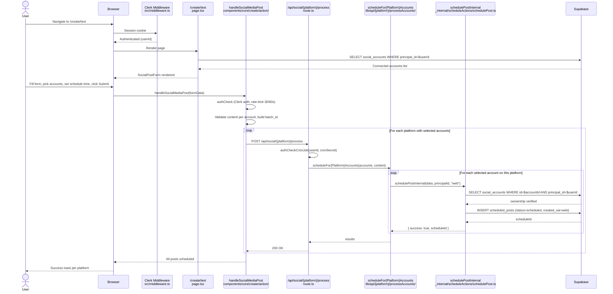
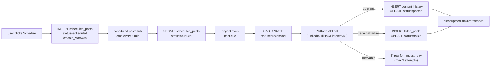
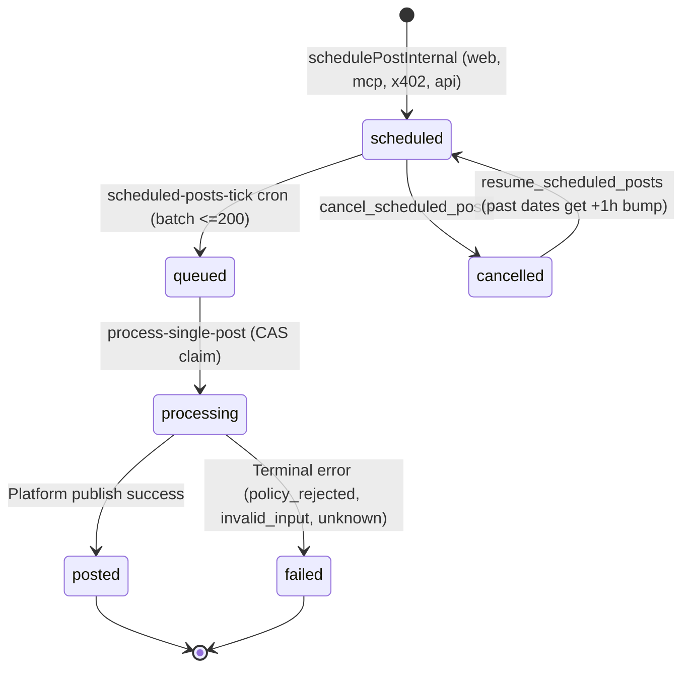
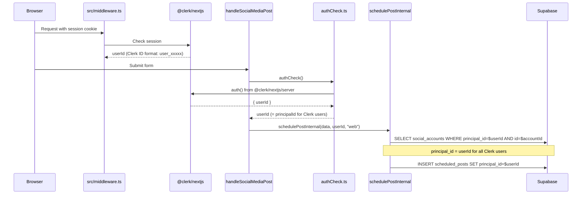

# Web Post Schedule Flow

Deep dive on how a post moves from "user clicks Create" to "post is live on LinkedIn" through the Web dashboard surface.

## Section 1: User journey

A user logs into sharetopus.com via Clerk (`src/middleware.ts:1` protects all `(protected)` routes). They navigate to `/create/text` (or `/create/image`, `/create/video`). The create page component (`src/app/(protected)/create/text/page.tsx:1`) renders the `SocialPostForm` component. The user fills in the post content, selects one or more connected social accounts, picks a future date/time, and clicks "Schedule". The form calls `handleSocialMediaPost` (`src/components/core/create/action/handleSocialMediaPost/index.ts:1`) which performs Clerk auth + rate limiting (30/60s), validates content per selected account, and dispatches one `POST` request per platform to `/api/social/{platform}/process`. Each process route calls `scheduleFor{Platform}Accounts` (e.g., `src/lib/api/linkedin/processAccounts/processLinkedinAccounts.ts:1`), which loops over selected accounts and calls `schedulePostInternal` (`src/actions/server/_internal/scheduleActions/schedulePost.ts:17`) for each. The row is inserted into `scheduled_posts` with `status=scheduled` and `created_via=web`.

Every 5 minutes, the `scheduled-posts-tick` Inngest cron (`src/inngest/functions/scheduledPostsTick.ts:1`) selects up to 200 due posts, updates their status to `queued`, and dispatches `post.due` events. The `process-single-post` worker (`src/inngest/functions/processSinglePost.ts:1`) claims each post via compare-and-swap (WHERE status=queued), calls the platform's post function (e.g., `postLinkedIn` from `src/lib/api/linkedin/data/postLinkedIn.ts:1`), and on success updates the status to `posted` and inserts a `content_history` row.

## Section 2: Full flow sequence diagram

## Section 3: File-by-file walkthrough

### `src/app/(protected)/create/text/page.tsx` (server component)

- Auth: Protected by Clerk middleware at `src/middleware.ts:1` (route pattern `/create`)
- Reads: social_accounts for the connected accounts dropdown
- Renders: `SocialPostForm` component from `src/components/core/create/SocialPostForm/`
- Imports: `@clerk/nextjs`, shared UI components

### `src/components/core/create/action/handleSocialMediaPost/index.ts`

- Purpose: Main posting handler for both "schedule" and "post now" web flows
- Auth: Calls `authCheck` from `src/actions/server/authCheck.ts:1` (Clerk session)
- Rate limit: `checkRateLimit("handleSocialMediaPost", userId, 30, 60)` from `src/actions/server/rateLimit/checkRateLimit.ts:39`
- Dispatches to: `POST /api/social/{platform}/process` for scheduling, `POST /api/social/{platform}/post` for direct posting
- Imports: `authCheck`, `checkRateLimit`, batch_id generation helpers, per-platform validation

### `src/app/api/social/linkedin/process/route.ts` (53 lines)

- HTTP method: POST
- Auth: `authCheckCronJob(body.userId, body.cronSecret)` at `route.ts:8`
- Purpose: Schedule LinkedIn posts for selected accounts
- Calls: `processLinkedinAccounts` from `src/lib/api/linkedin/processAccounts/processLinkedinAccounts.ts:1`
- DB reads: none directly (delegated to schedulePostInternal)
- DB writes: none directly (delegated to schedulePostInternal)
- Inngest events: none (scheduled_posts_tick cron handles dispatch)

### `src/lib/api/linkedin/processAccounts/processLinkedinAccounts.ts`

- Purpose: Loop over selected LinkedIn accounts and schedule a post for each
- Calls: `schedulePostInternal` from `src/actions/server/_internal/scheduleActions/schedulePost.ts:17`
- Uses generic adapter: `processAccountsGeneric` from `src/lib/api/_shared/processAccountsGeneric.ts:1`

### `src/actions/server/_internal/scheduleActions/schedulePost.ts` (190 lines)

- Function: `schedulePostInternal(data: SchedulePostData, principalId: string, createdVia: CreatedVia) => Promise<{success, message, scheduleId?}>` at line 17
- Inputs: `SchedulePostData` (socialAccountId, platform, scheduledAt, postType, title, description, mediaStoragePath, batch_id, idempotency_key, postOptions, coverTimestamp)
- Validation: required fields check (line 27-39), media required for non-text (line 41-46)
- Ownership: SELECT social_accounts WHERE id AND principal_id (line 49-54)
- DB write (no idempotency key): INSERT scheduled_posts with status=scheduled (line 84-88)
- DB write (with idempotency key): UPSERT with onConflict "principal_id,idempotency_key" ignoreDuplicates (line 124-130)
- Idempotent retry: if upsert returns 0 rows, SELECT existing row and return its ID (line 141-159)
- Errors-as-values: yes (returns `{success: false, message}` on failure, never throws)
- Callers:
  - Web: `processLinkedinAccounts`, `processTiktokAccounts`, `processPinterestAccounts`, `processInstagramAccounts`
  - MCP: `src/lib/mcp/tools/schedulePost.ts`
  - MCP: `src/lib/mcp/tools/bulkSchedule.ts`
- Imports:
  - `"server-only"` (build-time guard against client import)
  - `adminSupabase` from `@/actions/api/adminSupabase`
  - `SchedulePostData` from `@/lib/types/SchedulePostData`
  - `Json`, `CreatedVia` from `@/lib/types/database.types`

### `src/inngest/functions/scheduledPostsTick.ts`

- Function ID: `scheduled-posts-tick`
- Trigger: Cron `*/5 * * * *` (every 5 minutes)
- Concurrency: 1 (prevents overlap)
- Logic: SELECT scheduled_posts WHERE status=scheduled AND scheduled_at <= now() LIMIT 200, UPDATE status=queued, dispatch `post.due` event per post
- Event ID: `${postId}:${scheduledAt}` (24h Inngest dedup window)
- DB reads: scheduled_posts
- DB writes: scheduled_posts (status update)
- Inngest events: `post.due` (one per due post)

### `src/inngest/functions/processSinglePost.ts`

- Function ID: `process-single-post`
- Trigger: Event `post.due`
- Concurrency: 5 (dynamic based on memory)
- Retries: 3 (from RUNTIME.maxRetries)
- Throttle: 5/min per social_account_id
- Logic: CAS update status=processing, fetch social_account, build signed media URL, call platform post function
- DB reads: scheduled_posts, social_accounts
- DB writes: scheduled_posts (status=posted or status=failed), content_history (INSERT), failed_posts (INSERT on terminal failure)
- Platform dispatch: `postLinkedIn`, `postTikTok`, `postPinterest`, `postInstagram` from per-platform libs
- Error handling: retryable errors (auth_expired, rate_limited, transient) throw for Inngest retry; terminal errors (policy_rejected, invalid_input, unknown) recorded and function returns

## Section 4: DB write timeline

## Section 5: Post status state machine

## Section 6: Error paths

| Failure mode | What happens | Code location |
|---|---|---|
| Subscription expires mid-schedule | Post stays `scheduled`. When cron fires, worker fetches social_account but token refresh may fail. Error classified as `auth_expired` (retryable). After 3 retries, marked `failed`. | `src/inngest/functions/processSinglePost.ts`, `src/inngest/functions/platformErrors.ts` |
| Platform API returns 401 (token expired) | Worker attempts token refresh via `ensureValidToken` (`src/lib/api/ensureValidToken.ts:1`). If refresh fails, classified as `auth_expired` (retryable, up to 3 retries). | `src/inngest/functions/processSinglePostHelpers.ts` |
| Platform API returns 429 (rate limited) | Classified as `rate_limited` (retryable). Inngest backoff + per-account throttle (5/min) prevents flooding. | `src/inngest/functions/platformErrors.ts` |
| Inngest worker crashes (OOM, Vercel 300s timeout) | Post stuck in `processing`. `sweep-stuck-direct-posts` does NOT cover scheduled posts (only pending_direct_posts). Post stays stuck until manual intervention. | Gap: no sweep for stuck scheduled posts in `processing` state |
| Network failure to platform | Classified as `transient` (retryable, up to 3 retries). After exhaustion, marked `failed`. | `src/inngest/functions/platformErrors.ts` |
| DB connection lost during INSERT | `schedulePostInternal` returns `{success: false, message}`. User sees error toast. No partial state. | `src/actions/server/_internal/scheduleActions/schedulePost.ts:90-95` |

## Section 7: Auth chain

The Clerk `userId` (format: `user_<hex>`) IS the `principal_id` for all Web users. The `principals` table has `kind=clerk` for these rows. No separate ID translation needed.

## Section 8: Direct posting ("Post Now") flow

When the user clicks "Post Now" instead of "Schedule", the flow bypasses scheduled_posts entirely:

1. `handleSocialMediaPost` dispatches to `POST /api/social/{platform}/post` instead of `/process`
2. The post route calls `directPostFor{Platform}Accounts` (e.g., `src/lib/api/linkedin/post/directPostForLinkedInAccounts.ts:1`)
3. This inserts a `pending_direct_posts` row with `status=processing` (lock row to prevent premature media cleanup)
4. Dispatches Inngest `post.now` event via `dispatchPostNowEvents` (`src/inngest/dispatch/dispatchPostNowEvents.ts:1`)
5. `process-direct-post` worker (`src/inngest/functions/processDirectPost.ts:1`) picks up the event
6. Worker calls platform post function, finalizes pending_direct_posts row (completed or failed)
7. On success: inserts content_history, cleans up media (except TikTok, where the poll worker handles cleanup)

The web UI polls `GET /api/posts/status` (`src/app/api/posts/status/route.ts:1`) to track progress. As of commit `6281f6b`, polling reads directly from the DB (pending_direct_posts + content_history) instead of querying Inngest.

## Section 9: All Web API route handlers

### Social platform routes (16 handlers)

| Route | Method | File | Auth | Purpose |
|---|---|---|---|---|
| `/api/social/linkedin/initiate` | POST | `src/app/api/social/linkedin/initiate/route.ts` (141 lines) | Clerk auth() + subscription + account limits | Generate LinkedIn OAuth URL |
| `/api/social/linkedin/connect` | GET | `src/app/api/social/linkedin/connect/route.ts` (382 lines) | Clerk auth() + state cookie | LinkedIn OAuth callback, store tokens |
| `/api/social/linkedin/post` | POST | `src/app/api/social/linkedin/post/route.ts` | authCheckCronJob | Direct post to LinkedIn |
| `/api/social/linkedin/process` | POST | `src/app/api/social/linkedin/process/route.ts` (53 lines) | authCheckCronJob | Schedule LinkedIn posts |
| `/api/social/tiktok/initiate` | POST | `src/app/api/social/tiktok/initiate/route.ts` (132 lines) | Clerk auth() + subscription + account limits | Generate TikTok OAuth URL |
| `/api/social/tiktok/connect` | GET | `src/app/api/social/tiktok/connect/route.ts` (315 lines) | Clerk auth() + state cookie | TikTok OAuth callback |
| `/api/social/tiktok/post` | POST | `src/app/api/social/tiktok/post/route.ts` | authCheckCronJob | Direct post to TikTok |
| `/api/social/tiktok/process` | POST | `src/app/api/social/tiktok/process/route.ts` (53 lines) | authCheckCronJob | Schedule TikTok posts |
| `/api/social/pinterest/initiate` | POST | `src/app/api/social/pinterest/initiate/route.ts` (141 lines) | Clerk auth() + subscription + account limits | Generate Pinterest OAuth URL |
| `/api/social/pinterest/connect` | GET | `src/app/api/social/pinterest/connect/route.ts` (336 lines) | Clerk auth() + state cookie | Pinterest OAuth callback |
| `/api/social/pinterest/post` | POST | `src/app/api/social/pinterest/post/route.ts` | authCheckCronJob | Direct post to Pinterest |
| `/api/social/pinterest/process` | POST | `src/app/api/social/pinterest/process/route.ts` (53 lines) | authCheckCronJob | Schedule Pinterest posts |
| `/api/social/instagram/initiate` | POST | `src/app/api/social/instagram/initiate/route.ts` (150 lines) | Clerk auth() + subscription + account limits | Generate Instagram OAuth URL |
| `/api/social/instagram/connect` | GET | `src/app/api/social/instagram/connect/route.ts` (439 lines) | Clerk auth() + state cookie | Instagram OAuth callback (2-phase token) |
| `/api/social/instagram/post` | POST | `src/app/api/social/instagram/post/route.ts` | authCheckCronJob | Direct post to Instagram |
| `/api/social/instagram/process` | POST | `src/app/api/social/instagram/process/route.ts` (53 lines) | authCheckCronJob | Schedule Instagram posts |

### Other Web API routes (8 handlers)

| Route | Method | File | Auth | Purpose |
|---|---|---|---|---|
| `/api/storage/generate-upload-url` | POST | `src/app/api/storage/generate-upload-url/route.ts` | Clerk auth() + subscription | Generate signed upload URL (2h TTL) |
| `/api/storage/generate-view-url` | GET | `src/app/api/storage/generate-view-url/route.ts` | Clerk auth() | Generate signed view URL (5min TTL) |
| `/api/posts/status` | GET | `src/app/api/posts/status/route.ts` (149 lines) | Clerk auth() | Poll direct post status (DB-based since commit 6281f6b) |
| `/api/media` | GET | `src/app/api/media/route.ts` | HMAC signature | TikTok media proxy (stream from Supabase) |
| `/api/webhooks/clerk` | POST | `src/app/api/webhooks/clerk/route.ts` | Svix signature | User lifecycle: created/updated/deleted |
| `/api/webhooks/stripe` | POST | `src/app/api/webhooks/stripe/route.ts` (246 lines) | Stripe signature | Subscription + invoice events |
| `/api/inngest` | POST/GET | `src/app/api/inngest/route.ts` | Inngest signing key | Inngest serve endpoint (8 functions) |
| `/api/mcp/[transport]` | POST/GET | `src/app/api/mcp/[transport]/route.ts` (143 lines) | Bearer token | MCP server (covered in 03_MCP doc) |

### Web page components (13 pages)

| Page | Route | Type | Auth |
|---|---|---|---|
| Landing page | `/` | Marketing | Public |
| Privacy Policy | `/PrivacyPolicy` | Marketing | Public |
| Terms of Service | `/tos` | Marketing | Public |
| Connections | `/connections` | Protected | Clerk |
| Create (hub) | `/create` | Protected | Clerk |
| Create text | `/create/text` | Protected | Clerk |
| Create image | `/create/image` | Protected | Clerk |
| Create video | `/create/video` | Protected | Clerk |
| Scheduled posts | `/scheduled` | Protected | Clerk |
| Posted content | `/posted` | Protected | Clerk |
| Studio/Analytics | `/studio` | Protected | Clerk (Coming Soon placeholder) |
| Integrations | `/integrations` | Protected | Clerk |
| Payment success | `/payment/success` | Protected | Clerk |
| User profile | `/userProfile` | Protected | Clerk |

[Back to Index](./00_INDEX.md) | [Previous: Overview](./01_OVERVIEW.md) | [Next: MCP Post Schedule Flow](./03_MCP_POST_SCHEDULE_FLOW.md)
