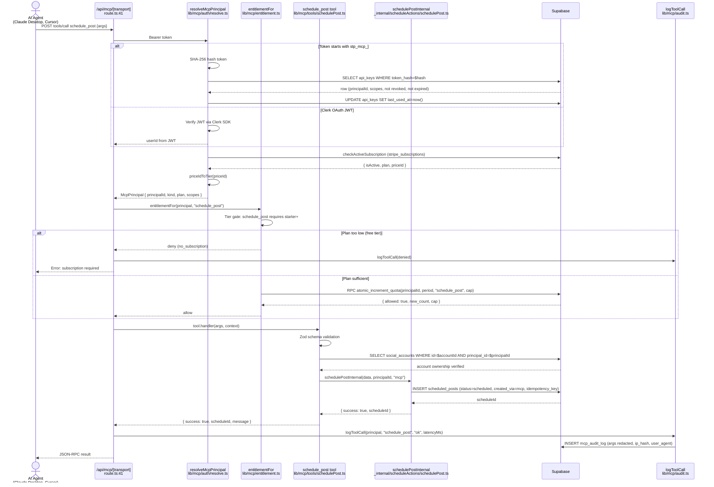
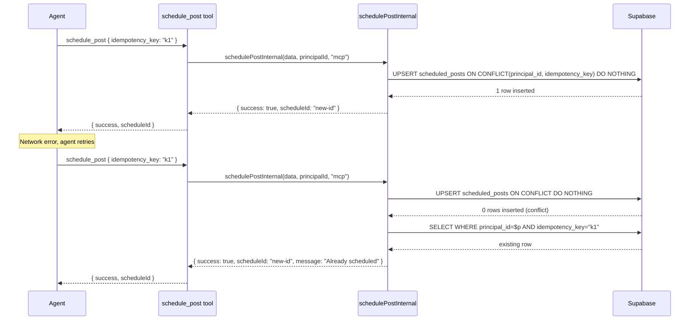
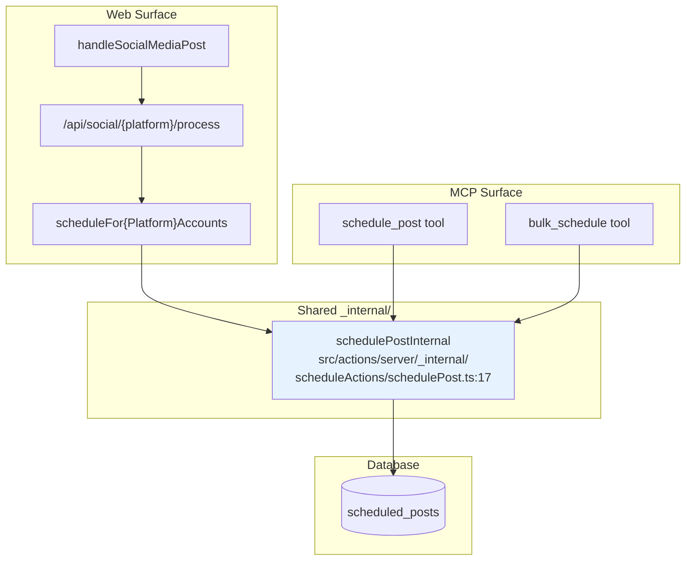

# MCP Post Schedule Flow

Deep dive on how an AI agent schedules a post via the MCP `schedule_post` tool and how it reaches publication.

## Section 1: Agent journey

An AI agent (Claude Desktop, Cursor, ChatGPT) connects to the MCP server at `https://sharetopus.com/api/mcp/mcp` with a Bearer token. On the first `initialize` request, the route handler (`src/app/api/mcp/[transport]/route.ts:41`) extracts `clientInfo.name` and `clientInfo.version` from the JSON-RPC params (lines 69-96). The token is resolved by `resolveMcpPrincipal` (`src/lib/mcp/auth.ts:1` re-exports from `src/lib/mcp/auth/resolve.ts:1`), which returns a `McpPrincipal` with cached plan tier or null (401).

The agent calls `tools/call schedule_post` with arguments. The tool handler at `src/lib/mcp/tools/schedulePost.ts:1` checks entitlement via `entitlementFor` (`src/lib/mcp/entitlement.ts:1`), which gates on tier (Starter+ required) and atomically increments the monthly quota via `atomic_increment_quota` Postgres RPC. If allowed, the tool calls `schedulePostInternal` (`src/actions/server/_internal/scheduleActions/schedulePost.ts:17`) with `createdVia="mcp"`. The rest of the flow (cron dispatch, Inngest worker, platform API call) is identical to the Web flow.

## Section 2: Full flow sequence diagram

## Section 3: Auth differences from Web

| Aspect | Web | MCP |
|---|---|---|
| Auth mechanism | Clerk session cookie (checked by `src/middleware.ts`) | Bearer token in Authorization header |
| Token resolution | `auth()` from `@clerk/nextjs/server` | `resolveMcpPrincipal` at `src/lib/mcp/auth/resolve.ts:1` |
| Principal source | Clerk `userId` directly | API key: SHA-256 hash lookup in `api_keys` table; OAuth: Clerk JWT verify |
| Subscription check | `checkActiveSubscription` (per-action, in `handleSocialMediaPost`) | `checkActiveSubscription` called once during auth resolution (cached on McpPrincipal) |
| Free tier | Allowed (no subscription needed for web UI) | Blocked (subscription gate refuses free tier at auth level) |
| Rate limiting | `checkRateLimit("handleSocialMediaPost", userId, 30, 60)` | Per-tool: `checkRateLimit("mcp_schedule_post", principalId)` (no rate limit on schedule_post specifically; rate limits only on media tools) |
| Quota | None (web has no monthly action cap) | Atomic via `atomic_increment_quota`: 100/mo (Starter), 500/mo (Creator), unlimited (Pro) |

## Section 4: Subscription gate

The subscription gate runs during auth resolution (`src/lib/mcp/auth/resolve.ts:1`), not per-tool. If `checkActiveSubscription` returns false, `resolveMcpPrincipal` returns null and the request gets a 401.

Active subscription statuses: `active`, `trialing`, `past_due` (from `src/actions/server/stripe/checkUserSubscription.ts:1`).

Rejected: `cancelled`, no subscription row.

Default on error: `false` (fail-closed, from `checkUserSubscription`).

## Section 5: Quota system

Monthly quotas are enforced atomically to prevent race conditions when multiple MCP clients make concurrent requests.

`entitlementFor` (`src/lib/mcp/entitlement.ts:1`) calls `atomic_increment_quota` Postgres RPC with:
- `_principal_id`: the MCP principal's ID
- `_period`: first of current month (e.g., `2026-05-01`), from `currentQuotaPeriod()` at `src/lib/mcp/_shared/currentQuotaPeriod.ts:1`
- `_action`: e.g., `"schedule_post"`
- `_cap`: tier-specific cap (100/500/unlimited)

The RPC atomically increments `usage_quotas.count` and returns `{ allowed, new_count, cap }`. If `new_count > cap`, the increment is rolled back and `allowed=false`.

Monthly caps by tier and action:

| Action | Starter | Creator | Pro |
|---|---|---|---|
| schedule_post | 100 | 500 | unlimited |
| post_now | 100 | 500 | unlimited |
| request_upload_url | 100 | 500 | unlimited |
| attach_media_from_url | 100 | 500 | unlimited |
| bulk_schedule | blocked | 200 | unlimited |
| bulk_post_now | blocked | 500 | unlimited |
| generate_post_draft | blocked | blocked | 100 |

## Section 6: Audit logging

Every MCP tool call is logged by `logToolCall` (`src/lib/mcp/audit.ts:1`) to the `mcp_audit_log` table (append-only, UPDATE blocked by DB trigger).

Fields logged:
- `principal_id`, `api_key_id` or `oauth_client_id`
- `session_id` (synthetic UUID per request, from `route.ts:111`)
- `tool_name` (e.g., "schedule_post")
- `args_redacted`: 13 key patterns replaced with `[REDACTED]` (token, password, secret, authorization, bearer, api_key, apikey, access_token, refresh_token, credential, private_key, jwt). JWTs detected by `xxx.yyy.zzz` pattern replaced with `[REDACTED_JWT]`. Truncated to 4096 chars.
- `result_status`: `ok`, `error`, `denied`, `rate_limited`, `quota_exceeded`
- `latency_ms`: measured via `performance.now()` delta
- `ip_hash`: SHA-256 of IP + salt (from `src/lib/mcp/ipHash.ts:16`), raw IP never stored
- `user_agent`: truncated to 512 chars

Session upsert: `logToolCall` also upserts `mcp_sessions` with `client_name`, `client_version`, `last_activity_at`. Uses `Promise.allSettled` for both operations.

## Section 7: Idempotent retries (schedule_post)

DB enforcement: partial unique index on `(principal_id, idempotency_key)` in `scheduled_posts` table. The key is optional (1-200 chars). Omitting it means no dedup (web callers do not use it).

## Section 8: Common code shared with Web

The `schedulePostInternal` function at `src/actions/server/_internal/scheduleActions/schedulePost.ts:17` is the single scheduling entry point for both surfaces.

The only difference is:
- Web passes `createdVia="web"` and no `idempotency_key`
- MCP passes `createdVia="mcp"` and optionally an `idempotency_key`

Both surfaces share the same Inngest dispatch (scheduled-posts-tick cron), the same worker (process-single-post), and the same platform post functions.

## Section 9: Tool input schema (schedule_post)

Zod schema at `src/lib/mcp/tools/schedulePost.ts`:

| Field | Type | Required | Default | Description |
|---|---|---|---|---|
| `social_account_id` | string (UUID) | yes | | Target social account |
| `platform` | enum (linkedin, tiktok, pinterest, instagram) | yes | | Target platform |
| `scheduled_at` | string (ISO 8601) | yes | | Must be in the future |
| `post_type` | enum (text, image, video) | yes | | Content type |
| `title` | string | no | | Post title |
| `description` | string or null | yes | | Post body/caption |
| `media_storage_path` | string | no | "" | Required for image/video |
| `batch_id` | string | no | "" | Group related posts |
| `pinterest_board_id` | string | no | | Required for Pinterest |
| `pinterest_board_name` | string | no | | Display name for content_history |
| `pinterest_link` | string (URL, max 2048) | no | | Destination URL for pin |
| `idempotency_key` | string (1-200) | no | | Safe retry key |

## Section 10: MCP tool inventory (all 18 tools)

| Tool | File | Tier | Monthly quota | Rate limit | Reads from _internal | Reads from lib/api |
|---|---|---|---|---|---|---|
| `list_connections` | `listConnections.ts` | Free | - | - | `fetchSocialAccountsInternal` | - |
| `list_pinterest_boards` | `listPinterestBoards.ts` | Free | - | - | - | `getPinterestBoards`, `ensureValidToken` |
| `list_scheduled_posts` | `listScheduledPosts.ts` | Free | - | - | `getScheduledPostsInternal` | - |
| `list_content_history` | `listContentHistory.ts` | Free | - | - | `getContentHistoryInternal` | - |
| `list_billing_summary` | `listBillingSummary.ts` | Free | - | - | - | - |
| `request_account_reauth_link` | `requestAccountReauthLink.ts` | Free | - | - | - | - |
| `schedule_post` | `schedulePost.ts` | Starter+ | 100/500/unlim | - | `schedulePostInternal` | - |
| `post_now` | `postNow.ts` | Starter+ | 100/500/unlim | - | - | `buildProxiedTikTokMediaUrl` |
| `cancel_scheduled_posts` | `cancelScheduledPosts.ts` | Starter+ | - | - | `cancelScheduledPostBatchInternal` | - |
| `resume_scheduled_posts` | `resumeScheduledPosts.ts` | Starter+ | - | - | `resumeScheduledPostBatchInternal` | - |
| `reschedule_posts` | `reschedulePosts.ts` | Starter+ | - | - | `updateScheduledTimeBatchInternal` | - |
| `delete_scheduled_posts` | `deleteScheduledPosts.ts` | Starter+ | - | - | `deleteScheduledPostBatchInternal` | - |
| `attach_media_from_url` | `attachMediaFromUrl.ts` | Starter+ | 100/500/unlim | 10/60s | - | - |
| `request_upload_url` | `requestUploadUrl.ts` | Starter+ | 100/500/unlim | 20/60s | - | - |
| `bulk_schedule` | `bulkSchedule.ts` | Creator+ | 200/unlim | - | `schedulePostInternal` | - |
| `bulk_post_now` | `bulkPostNow.ts` | Creator+ | 500/unlim | - | - | `buildProxiedTikTokMediaUrl` |
| `get_account_analytics` | `getAccountAnalytics.ts` | Creator+ | - | - | - | - |
| `generate_post_draft` | `generatePostDraft.ts` | Pro | 100/mo | - | - | - |

[Back to Index](./00_INDEX.md) | [Previous: Web Flow](./02_WEB_POST_SCHEDULE_FLOW.md) | [Next: x402 Flows](./04_X402_FLOWS.md)
