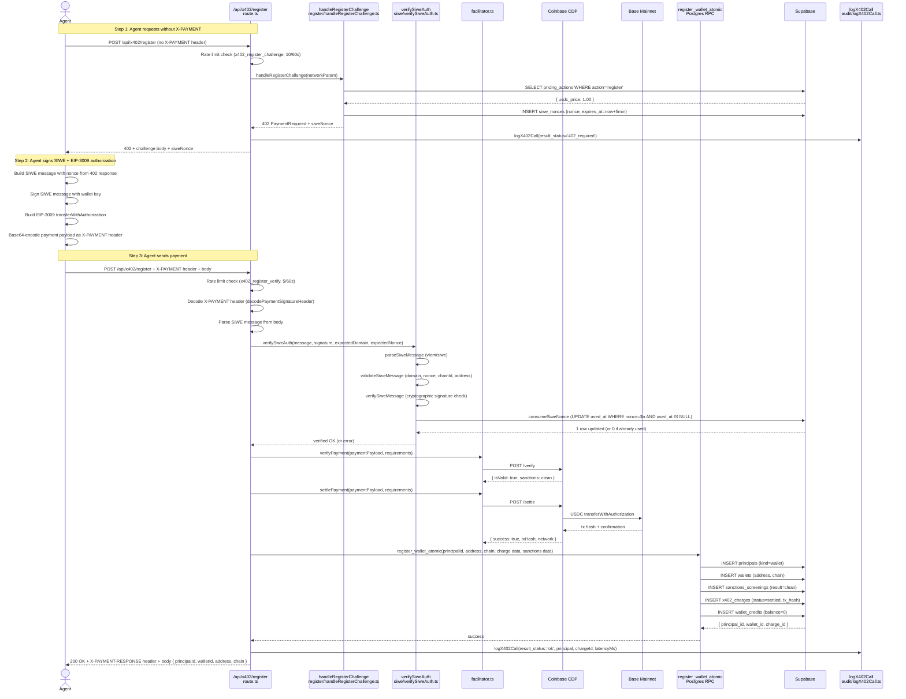
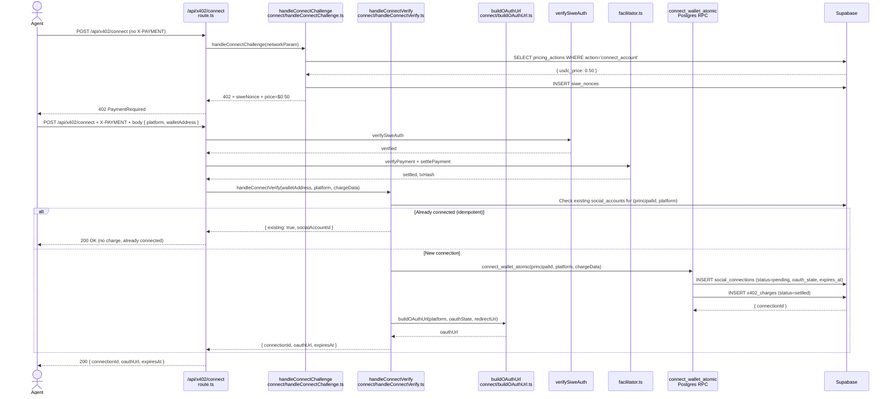
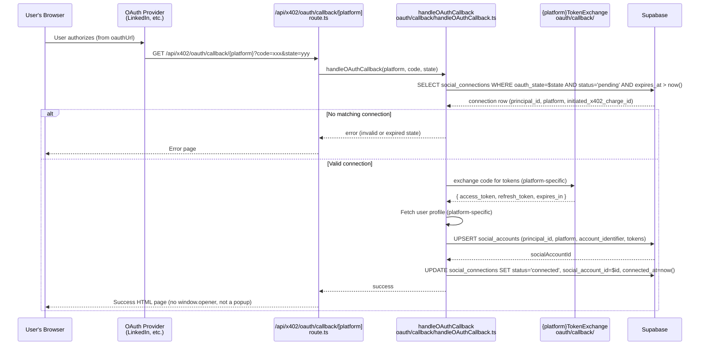
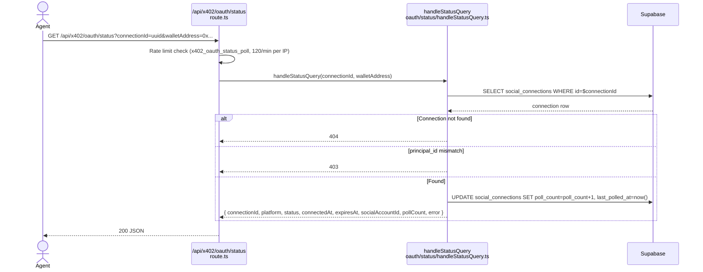

# x402 Flows

Documents what x402 ships TODAY: Phase 4.1 (register) and Phase 4.2 (connect + OAuth callback + status poll). Post endpoints are planned (Phase 4.3) but not built.

## Section 1: x402 surface overview

The x402 surface enables AI agents to interact with Sharetopus by paying per action with USDC instead of holding a monthly Stripe subscription. Key differences from Web and MCP:

- **Per-call payment:** Each action (register, connect) requires a USDC payment via EIP-3009 `transferWithAuthorization` or SPL token transfer. No subscription needed.
- **No persistent session:** Each request is authenticated by verifying a SIWE (Sign-In With Ethereum) signature against the wallet address. No cookies, no JWT session.
- **Wallet principal:** Creates `principals` with `kind=wallet` and ID format `wallet_<32 hex>` instead of `user_<clerk hex>`.
- **Facilitator pattern:** Payments are verified and settled through Coinbase CDP (`src/lib/x402/facilitator.ts:1`), not Stripe.
- **Sanctions screening:** Every registration runs `applyWalletGate` (`src/lib/x402/sanctions/applyWalletGate.ts:1`) to check against sanctions lists.

### Route inventory

| Route | Method | File | Purpose |
|---|---|---|---|
| `/api/x402/register` | POST | `src/app/api/x402/register/route.ts:1` | Register wallet principal (Phase 4.1) |
| `/api/x402/connect` | POST | `src/app/api/x402/connect/route.ts:1` | Initiate social account connection (Phase 4.2) |
| `/api/x402/oauth/callback/[platform]` | GET | `src/app/api/x402/oauth/callback/[platform]/route.ts:1` | OAuth callback handler (Phase 4.2) |
| `/api/x402/oauth/status` | GET | `src/app/api/x402/oauth/status/route.ts:1` | Poll connection status (Phase 4.2) |

### Lib file inventory

| Directory | Files | Purpose |
|---|---|---|
| `src/lib/x402/auth/` | `resolveWalletPrincipal.ts`, `types.ts` | Wallet principal lookup, WalletPrincipal type |
| `src/lib/x402/register/` | `handleRegisterChallenge.ts`, `handleRegisterVerify.ts`, `handleRegisterSolanaVerify.ts`, `insertRegisterAtomic.ts`, `types.ts` | Register flow logic |
| `src/lib/x402/connect/` | `handleConnectChallenge.ts`, `handleConnectVerify.ts`, `insertConnectAtomic.ts`, `buildOAuthUrl.ts`, `types.ts` | Connect flow logic |
| `src/lib/x402/oauth/` | `state.ts`, `connectionToken.ts`, `types.ts` | OAuth state management |
| `src/lib/x402/oauth/callback/` | `handleOAuthCallback.ts`, `linkedinTokenExchange.ts`, `tiktokTokenExchange.ts`, `pinterestTokenExchange.ts`, `instagramTokenExchange.ts` | Per-platform OAuth callback handling |
| `src/lib/x402/oauth/status/` | `handleStatusQuery.ts` | Status polling logic |
| `src/lib/x402/siwe/` | `verifySiweAuth.ts`, `createSiweNonce.ts`, `consumeSiweNonce.ts` | SIWE signature verification |
| `src/lib/x402/solana/` | `verifySolanaSiweAuth.ts`, `refundSolana.ts` | Solana-specific verification |
| `src/lib/x402/sanctions/` | `applyWalletGate.ts` | Sanctions screening |
| `src/lib/x402/responses/` | `buildErrorResponse.ts`, `buildPaymentRequiredResponse.ts`, `buildSuccessResponse.ts` | Response builders |
| `src/lib/x402/audit/` | `logX402Call.ts` | Audit logging to x402_access_log |
| `src/lib/x402/` | `facilitator.ts`, `networks.ts` | CDP facilitator wrapper, network registry |

## Section 2: Register flow (Phase 4.1)

### Sequence diagram



### Refund on DB failure

If `register_wallet_atomic` fails AFTER `settlePayment` succeeds (payment already on-chain), the route calls `refundPayment` from `src/lib/x402/facilitator.ts:359`:

- EVM chains: `cdp.evm.sendTransaction` with ERC-20 transfer calldata (works)
- Solana chains: `refundSolana` at `src/lib/x402/solana/refundSolana.ts:1` (returns stub with `facilitator_error`, logs warning for manual processing)

### Error matrix

| Error | HTTP | Response body |
|---|---|---|
| Missing X-PAYMENT | 402 | x402 challenge + siweNonce |
| Malformed X-PAYMENT | 400 | `{ error: "malformed_payment" }` |
| SIWE signature invalid | 401 | `{ error: "siwe_invalid" }` |
| SIWE nonce used/expired | 401 | `{ error: "siwe_nonce_invalid" }` |
| SIWE address mismatch | 401 | `{ error: "siwe_address_mismatch" }` |
| Verify failed (amount/network) | 402 | Re-issue challenge |
| KYT sanctioned | 403 | `{ error: "sanctioned" }` |
| Facilitator unavailable | 502 | `{ error: "facilitator_unavailable" }` |
| Rate limited | 429 | `{ error: "rate_limited", retryAfter }` |
| DB insert post-settle | 500 | `{ error: "internal", refundInitiated: true }` |
| Wallet already registered | 200 | Existing payload (idempotent) |

## Section 3: Connect flow (Phase 4.2)



### OAuth URL construction

`buildOAuthUrl` at `src/lib/x402/connect/buildOAuthUrl.ts:1` constructs the platform-specific OAuth URL. Uses a switch statement on platform, with per-platform scopes, redirect URIs, and OAuth endpoints:

| Platform | OAuth URL | Redirect URI | Scopes |
|---|---|---|---|
| LinkedIn | `https://www.linkedin.com/oauth/v2/authorization` | `/api/x402/oauth/callback/linkedin` | openid, profile, email, w_member_social |
| TikTok | `https://www.tiktok.com/v2/auth/authorize/` | `/api/x402/oauth/callback/tiktok` | user.info.basic, video.publish, video.upload, user.info.stats |
| Pinterest | `https://www.pinterest.com/oauth/` | `/api/x402/oauth/callback/pinterest` | boards:read/write, pins:read/write, user_accounts:read |
| Instagram | `https://www.instagram.com/oauth/authorize` | `/api/x402/oauth/callback/instagram` | instagram_business_basic, instagram_business_content_publish |

## Section 4: OAuth callback (Phase 4.2)



### Per-platform token exchange

Each platform has its own token exchange file under `src/lib/x402/oauth/callback/`:

| File | Token endpoint | Auth method |
|---|---|---|
| `linkedinTokenExchange.ts` | `https://www.linkedin.com/oauth/v2/accessToken` | client_id + client_secret as form params |
| `tiktokTokenExchange.ts` | `https://open.tiktokapis.com/v2/oauth/token/` | client_key + client_secret as form params |
| `pinterestTokenExchange.ts` | `https://api.pinterest.com/v5/oauth/token` | Basic Auth header (base64 client_id:client_secret) |
| `instagramTokenExchange.ts` | `https://api.instagram.com/oauth/access_token` then `https://graph.instagram.com/access_token` (long-lived upgrade) | client_id + client_secret as form params |

These are SEPARATE from the Web callback token exchange functions (which live in `src/lib/api/{platform}/data/exchange{Platform}Code.ts`). The x402 versions use dedicated redirect URIs and do not depend on Clerk auth.

## Section 5: Status polling (Phase 4.2)



Status values for `social_connections.status`: `pending`, `connected`, `expired`, `failed`, `revoked`.

Auth model: Public access by connectionId UUID + walletAddress verification. The connectionId is 128-bit random (unguessable). The agent receives it from the /connect response and is not exposed elsewhere.

## Section 6: x402-specific database tables (ER diagram)

```mermaid
erDiagram
    principals ||--o| wallets : "kind=wallet"
    principals ||--o{ social_connections : "owns"
    principals ||--o{ x402_charges : "pays"
    principals ||--o{ wallet_credits : "balance"

    wallets {
        uuid id PK_FK
        text address
        text chain
    }

    social_connections {
        uuid id PK
        text principal_id FK
        text initiated_via
        text initiated_x402_charge_id FK
        text platform
        text oauth_state UNIQUE
        text redirect_uri
        text status
        text expires_at
        text connected_at
        text social_account_id FK
        int poll_count
    }

    x402_charges {
        uuid id PK
        text principal_id FK
        text nonce UNIQUE
        text action
        text tx_hash
        numeric amount_usdc
        text network
        text status
    }

    wallet_credits {
        uuid id PK
        text principal_id FK
        numeric balance
    }

    siwe_nonces {
        text nonce PK
        text wallet
        text expires_at
        text used_at
    }

    sanctions_screenings {
        uuid id PK
        text wallet_address
        text result
        text source
    }

    x402_access_log {
        uuid id PK
        text principal_id
        text action
        text result_status
        int latency_ms
        text ip_hash
    }
```

## Section 7: Comparison table with Web + MCP

| Aspect | Web | MCP | x402 |
|---|---|---|---|
| Auth mechanism | Clerk session cookie | Bearer token (API key or OAuth JWT) | SIWE signature + X-PAYMENT header |
| Principal type | `kind=clerk` | `kind=clerk` | `kind=wallet` |
| Principal ID format | `user_<clerk hex>` | `user_<clerk hex>` or `apikey_<hex>` (resolves to user) | `wallet_<32 hex>` |
| Billing model | Stripe monthly subscription | Stripe monthly subscription | USDC per action via CDP |
| Charge mechanism | Stripe Checkout | Stripe subscription (same as Web) | EIP-3009 transferWithAuthorization |
| Rate limit scope key | `userId` (Clerk) | `principalId` (from McpPrincipal) | IP hash (no authenticated principal at challenge time) |
| Audit table | None specific | `mcp_audit_log` (append-only) | `x402_access_log` (append-only) |
| Session tracking | Clerk session cookie | `mcp_sessions` (per-request UUID) | None (stateless) |
| OAuth state storage | httpOnly cookie (15min TTL) | n/a (no OAuth initiation from MCP) | `social_connections.oauth_state` (DB row) |
| OAuth callback URL | `/api/social/{platform}/connect` | n/a | `/api/x402/oauth/callback/[platform]` |
| OAuth callback auth | Clerk `auth()` required | n/a | State-based lookup (no Clerk dependency) |
| OAuth callback response | HTML popup with `window.opener` | n/a | HTML success page (no popup) |
| Token exchange code | `src/lib/api/{platform}/data/exchange{Platform}Code.ts` | n/a | `src/lib/x402/oauth/callback/{platform}TokenExchange.ts` |
| Account connect charge | Free (included in subscription) | Free (included in subscription) | $0.50 USDC per new connection |
| Register charge | Free (Clerk webhook) | n/a | $1.00 USDC |
| Sanctions screening | None | None | `applyWalletGate` on register |
| Refund mechanism | Stripe (managed by Stripe) | n/a | CDP refundPayment (EVM works, Solana stub) |
| Social account ownership | `social_accounts.principal_id = user_xxx` | Same as Web | `social_accounts.principal_id = wallet_xxx` |
| Idempotent register | Via Clerk webhook dedup | n/a | Wallet already exists check (200 OK) |
| Network support | n/a | n/a | Base mainnet, Base Sepolia, Solana mainnet, Solana devnet |
| Post scheduling | Shipped (handleSocialMediaPost) | Shipped (schedule_post tool) | Phase 4.3 (not built) |

## Section 8: Network registry

`src/lib/x402/networks.ts:1` defines 4 network configurations:

| Network key | CAIP-2 | Chain ID | isEvm | USDC address | Recipient env var |
|---|---|---|---|---|---|
| `base` | `eip155:8453` | 8453 | true | `0x833589fCD6eDb6E08f4c7C32D4f71b54bdA02913` | `X402_RECIPIENT_EVM` |
| `base-sepolia` | `eip155:84532` | 84532 | true | `0x036CbD53842c5426634e7929541eC2318f3dCF7e` | `X402_RECIPIENT_EVM` |
| `solana` | `solana:5eykt4UsFv8P8NJdTREpY1vzqKqZKvdp` | null | false | `EPjFWdd5AufqSSqeM2qN1xzybapC8G4wEGGkZwyTDt1v` | `X402_RECIPIENT_SOLANA` |
| `solana-devnet` | `solana:EtWTRABZaYq6iMfeYKouRu166VU2xqa1` | null | false | `4zMMC9srt5Ri5X14GAgXhaHii3GnPAEERYPJgZJDncDU` | `X402_RECIPIENT_SOLANA` |

Helper functions: `getNetworkConfig(key)` at line 135, `getDefaultNetwork()` at line 143 (reads `X402_DEFAULT_NETWORK` env), `getTestnetNetwork()` at line 158 (reads `X402_TESTNET_NETWORK` env), `isEvmNetwork(config)` at line 168.

## Section 9: Facilitator wrapper

`src/lib/x402/facilitator.ts:1` wraps the Coinbase CDP facilitator API:

| Function | Line | Purpose |
|---|---|---|
| `getCdpClient()` | ~47 | Lazy singleton CDP client (reads `CDP_API_KEY_ID`, `CDP_API_KEY_SECRET`, `CDP_WALLET_SECRET`) |
| `getFacilitatorClient()` | ~78 | Lazy singleton facilitator client (reads `X402_FACILITATOR_URL`) |
| `verifyPayment(input)` | ~123 | Verify payment signature via facilitator. Returns ok/error with typed error kinds. |
| `settlePayment(input)` | ~260 | Settle payment on-chain. Returns ok with txHash or error. |
| `refundPayment(input)` | ~359 | Refund settled payment. EVM: ERC-20 transfer. Solana: stub (returns facilitator_error). |
| `extractNonceFromPayload(payload)` | ~493 | Extract EIP-3009 nonce from payment payload. |

Error kinds returned by facilitator functions: `amount_mismatch`, `network_mismatch`, `recipient_mismatch`, `replay`, `sanctioned`, `invalid_signature`, `facilitator_error`, `insufficient_funds`, `not_verified`, `timeout`.

## Section 10: File-by-file walkthrough of x402 lib

### `src/lib/x402/auth/types.ts` (~59 lines)

Defines the `WalletPrincipal` type (discriminated from `McpPrincipal`):
```
WalletPrincipal { kind: "wallet", principalId: string, walletAddress: string, chain: string }
```

Also defines `X402AuthResult`, `X402ErrorKind`, and other auth-related types.

### `src/lib/x402/auth/resolveWalletPrincipal.ts` (~65 lines)

- Exported: `resolveWalletPrincipal(address: string, chain: string) => Promise<WalletPrincipal | null>`
- DB reads: `wallets` WHERE address=$address AND chain=$chain, JOIN `principals`
- Returns null if wallet not registered (triggers 402 challenge in route handler)
- Imports: `adminSupabase`

### `src/lib/x402/register/handleRegisterChallenge.ts` (~109 lines)

- Builds the 402 PaymentRequired response for register
- DB reads: `pricing_actions` WHERE action='register' (fetches USDC price)
- DB writes: `siwe_nonces` INSERT (nonce, expires_at=now+5min)
- Uses: `getDefaultNetwork()` or `getTestnetNetwork()` from `networks.ts`
- Returns: 402 response body with `accepts` array, `siweNonce`, `siweExpiresAt`

### `src/lib/x402/register/handleRegisterVerify.ts` (~548 lines)

- The largest file in x402. Handles the full post-payment verification flow.
- Steps: decode X-PAYMENT, parse SIWE message, validate fields (domain, nonce, chainId, address), consume SIWE nonce, verify payment via facilitator, settle payment, atomic DB insert, build success response
- On DB failure after settlement: calls `refundPayment`, returns 500 with `refundInitiated: true`
- Idempotent: checks `wallets` table for existing address before insert. Returns 200 with existing data.
- Imports: `verifySiweAuth`, `consumeSiweNonce`, `verifyPayment`, `settlePayment`, `refundPayment`, `insertRegisterAtomic`, `resolveWalletPrincipal`, `buildSuccessResponse`, `buildErrorResponse`

### `src/lib/x402/register/handleRegisterSolanaVerify.ts`

- Solana-specific register verification
- Uses Ed25519 signature verification instead of EVM ecrecover
- Calls `verifySolanaSiweAuth` from `src/lib/x402/solana/verifySolanaSiweAuth.ts`
- Same atomic DB insert pattern as EVM register

### `src/lib/x402/register/insertRegisterAtomic.ts`

- Calls `register_wallet_atomic` Postgres RPC
- Single round-trip for 5 INSERTs: principals, wallets, sanctions_screenings, x402_charges, wallet_credits
- Returns `{ principal_id, wallet_id, charge_id }` on success
- Raises exception on failure (triggers automatic rollback of all 5 inserts)

### `src/lib/x402/connect/handleConnectChallenge.ts`

- Builds the 402 PaymentRequired response for connect
- DB reads: `pricing_actions` WHERE action='connect_account' ($0.50 USDC)
- DB writes: `siwe_nonces` INSERT
- Similar to register challenge but with different pricing action

### `src/lib/x402/connect/handleConnectVerify.ts`

- Post-payment verification for connect
- Checks existing social_accounts for idempotent re-connection (no charge)
- Calls `insertConnectAtomic` for new connections
- Builds OAuth URL via `buildOAuthUrl`
- Returns `{ connectionId, oauthUrl, expiresAt }`

### `src/lib/x402/connect/buildOAuthUrl.ts`

- Switch statement on platform (linkedin, tiktok, pinterest, instagram)
- Per-platform: scopes, OAuth endpoint, client ID env var, redirect URI
- Redirect URIs point to `/api/x402/oauth/callback/{platform}` (NOT the Web callback URLs)
- State parameter: the `oauth_state` from the social_connections row

### `src/lib/x402/connect/insertConnectAtomic.ts`

- Calls `connect_wallet_atomic` Postgres RPC
- Inserts: social_connections (status=pending, oauth_state, expires_at) + x402_charges
- Returns `{ connectionId, oauthState }`

### `src/lib/x402/oauth/callback/handleOAuthCallback.ts`

- Shared callback handler for all 4 platforms
- Looks up social_connections by `oauth_state` (from `state` query param)
- Verifies: status='pending', expires_at > now()
- Delegates to per-platform token exchange
- UPSERTs social_accounts with tokens
- Updates social_connections: status='connected', connected_at=now()
- Imports: `adminSupabase`, per-platform token exchange functions

### `src/lib/x402/siwe/verifySiweAuth.ts`

- Wrapper around `viem/siwe` functions
- Calls `parseSiweMessage`, `validateSiweMessage`, `verifySiweMessage` from `viem/siwe`
- Validates: domain (from `NEXT_PUBLIC_BASE_URL`), nonce, chainId, address match
- Creates a viem public client per network for on-chain verification (smart contract wallets)

### `src/lib/x402/siwe/createSiweNonce.ts`

- Uses `generateSiweNonce()` from `viem/siwe`
- INSERTs into `siwe_nonces` table with 5-minute expiry
- Returns the nonce string

### `src/lib/x402/siwe/consumeSiweNonce.ts`

- UPDATE siwe_nonces SET used_at=now() WHERE nonce=$n AND used_at IS NULL AND expires_at > now()
- Returns true if 1 row updated, false if 0 (nonce already used, expired, or missing)
- Single atomic operation prevents race conditions

### `src/lib/x402/sanctions/applyWalletGate.ts` (~88 lines)

- Checks wallet address against sanctions lists
- Currently logs to `sanctions_screenings` table with `result=clean` (no real screening service integrated)
- Placeholder for OFAC / FINTRAC / MiCA screening in future phases
- Called during register flow before atomic DB insert

### `src/lib/x402/responses/buildPaymentRequiredResponse.ts` (~17 lines)

- Builds the 402 response body conforming to x402 spec V2
- Sets `x402Version: 2`, `resource`, `accepts` array

### `src/lib/x402/responses/buildSuccessResponse.ts` (~22 lines)

- Builds 200 response with `X-PAYMENT-RESPONSE` header (base64-encoded `SettleResponse`)
- Uses `encodePaymentResponseHeader` from `@x402/core/http`

### `src/lib/x402/responses/buildErrorResponse.ts` (~151 lines)

- Maps x402 error kinds to HTTP status codes and response bodies
- 21 error variants mapped (see error matrix in Section 2)
- Consistent `{ error: string, ...details }` response shape

### `src/lib/x402/audit/logX402Call.ts` (~93 lines)

- Inserts into `x402_access_log` table (append-only)
- Fields: action, result_status, principal_id, charge_id, ip_hash, user_agent, latency_ms
- Awaited (not fire-and-forget), but errors caught internally
- Imports: `adminSupabase`

### `src/lib/x402/facilitator.ts` (~584 lines)

- Largest shared file in x402
- Wraps Coinbase CDP facilitator API
- Key functions: `getCdpClient()`, `getFacilitatorClient()`, `verifyPayment()`, `settlePayment()`, `refundPayment()`, `extractNonceFromPayload()`
- EVM refund: works via `cdp.evm.sendTransaction` with ERC-20 transfer calldata
- Solana refund: stub at `refundSolana` (returns `facilitator_error`)

### `src/lib/x402/networks.ts` (~170 lines)

- Defines 4 NetworkConfig objects: base, base-sepolia, solana, solana-devnet
- Each has: name, caipNetwork, chainId, usdcAddress, rpcUrl, isEvm
- Helper functions: `getNetworkConfig`, `getDefaultNetwork`, `getTestnetNetwork`, `isEvmNetwork`

### SQL migration: `scripts/migrations/connect_wallet_atomic.sql`

- Creates the `connect_wallet_atomic` Postgres RPC function
- Atomic INSERT: social_connections + x402_charges
- Parameters: principal_id, platform, oauth_state, redirect_uri, expires_at, charge data
- Returns: connectionId, oauthState
- Error handling: exception triggers automatic rollback

## Section 11: What's NOT built yet

- **Phase 4.3:** Post endpoints for wallet principals. `schedulePostInternal` already accepts `createdVia="x402"` but no x402 route calls it.
- **Phase 4.4:** Refund cron for abandoned connections (`social_connections.status='pending' AND expires_at < now()`).
- **Phase 4.5:** CDP webhook handler (for async settlement confirmation on reorgs).
- **Solana refund:** `refundSolana` at `src/lib/x402/solana/refundSolana.ts:1` returns stub with `facilitator_error`.
- **Token encryption:** `social_accounts.access_token` and `refresh_token` stored plaintext in DB. Flagged in RECON_X402_PHASE_4_2.md as security finding.

[Back to Index](./00_INDEX.md) | [Previous: MCP Flow](./03_MCP_POST_SCHEDULE_FLOW.md) | [Next: Shared Internal Actions](./05_SHARED_INTERNAL_ACTIONS.md)
