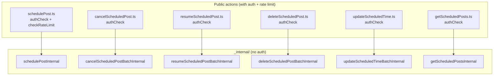

# Shared Internal Actions

Documents the `src/actions/server/_internal/` layer: the surface-agnostic business logic consumed by Web routes, MCP tools, and (eventually) x402 endpoints.

## Section 1: Why \_internal/ exists

The `_internal/` directory contains business logic functions that skip Clerk auth. MCP tools (which authenticate via Bearer token, not Clerk session) and Web routes (which authenticate via Clerk and then delegate) both call these functions. The `"server-only"` import at the top of each file prevents accidental import from client components at build time.

## Section 2: Consumers diagram

```mermaid
graph TB
    subgraph Internal["src/actions/server/_internal/ (10 files)"]
        SPI["schedulePostInternal<br/>scheduleActions/schedulePost.ts:17"]
        CSPBI["cancelScheduledPostBatchInternal<br/>scheduleActions/cancelScheduledPostBatch.ts"]
        RSPBI["resumeScheduledPostBatchInternal<br/>scheduleActions/resumeScheduledPostBatch.ts"]
        DSPBI["deleteScheduledPostBatchInternal<br/>scheduleActions/deleteScheduledPostBatch.ts"]
        USTBI["updateScheduledTimeBatchInternal<br/>scheduleActions/updateScheduledTimeBatch.ts"]
        GSPI["getScheduledPostsInternal<br/>scheduleActions/getScheduledPosts.ts"]
        GCHI["getContentHistoryInternal<br/>contentHistoryActions/getContentHistory.ts"]
        FSAI["fetchSocialAccountsInternal<br/>data/fetchSocialAccounts.ts"]
        DSFA["deleteSupabaseFile<br/>data/deleteSupabaseFileAction.ts"]
        BPSF["bumpPastScheduleToFuture<br/>scheduleActions/_shared/bumpPastScheduleToFuture.ts"]
    end

    subgraph Web["Web Routes"]
        WebSchedule["handleSocialMediaPost<br/>+ /api/social/{platform}/process"]
        WebCancel["scheduleActions/cancelScheduledPost.ts"]
        WebResume["scheduleActions/resumeScheduledPost.ts"]
        WebDelete["scheduleActions/deleteScheduledPost.ts"]
        WebUpdate["scheduleActions/updateScheduledTime.ts"]
        WebGet["scheduleActions/getScheduledPosts.ts"]
    end

    subgraph MCP["MCP Tools"]
        MCPSchedule["schedule_post, bulk_schedule"]
        MCPCancel["cancel_scheduled_posts"]
        MCPResume["resume_scheduled_posts"]
        MCPDelete["delete_scheduled_posts"]
        MCPReschedule["reschedule_posts"]
        MCPListSched["list_scheduled_posts"]
        MCPListCH["list_content_history"]
        MCPListConn["list_connections"]
    end

    subgraph X402["x402 Routes (Phase 4.3+)"]
        X402Post["planned: post endpoints"]
    end

    WebSchedule --> SPI
    WebCancel --> CSPBI
    WebResume --> RSPBI
    WebDelete --> DSPBI
    WebUpdate --> USTBI
    WebGet --> GSPI

    MCPSchedule --> SPI
    MCPCancel --> CSPBI
    MCPResume --> RSPBI
    MCPDelete --> DSPBI
    MCPReschedule --> USTBI
    MCPListSched --> GSPI
    MCPListCH --> GCHI
    MCPListConn --> FSAI

    X402Post -.->|"Phase 4.3"| SPI
```



## Section 3: Action-by-action enumeration

### `src/actions/server/_internal/scheduleActions/schedulePost.ts` (190 lines)

- **Exported:** `schedulePostInternal(data: SchedulePostData, principalId: string, createdVia: CreatedVia) => Promise<{success, message, scheduleId?}>`
- **Signature:** line 17
- **DB reads:** `social_accounts` (ownership check, line 49-54)
- **DB writes:** `scheduled_posts` INSERT (line 84 without idempotency key, line 124 with idempotency key)
- **Inngest:** none (cron handles dispatch)
- **Errors-as-values:** yes (returns `{success: false, message}`)
- **Callers:**
  - Web: `processLinkedinAccounts`, `processTiktokAccounts`, `processPinterestAccounts`, `processInstagramAccounts` (via `processAccountsGeneric`)
  - MCP: `src/lib/mcp/tools/schedulePost.ts`, `src/lib/mcp/tools/bulkSchedule.ts`
- **Imports:** `"server-only"`, `adminSupabase`, `SchedulePostData`, `Json`, `CreatedVia`

### `src/actions/server/_internal/scheduleActions/cancelScheduledPostBatch.ts`

- **Exported:** `cancelScheduledPostBatchInternal(postIds: string[], principalId: string) => Promise<BatchResult[]>`
- **DB reads:** `scheduled_posts` (verify ownership + status=scheduled)
- **DB writes:** `scheduled_posts` UPDATE status=cancelled
- **Callers:**
  - Web: `src/actions/server/scheduleActions/cancelScheduledPost.ts`
  - MCP: `src/lib/mcp/tools/cancelScheduledPosts.ts`

### `src/actions/server/_internal/scheduleActions/resumeScheduledPostBatch.ts`

- **Exported:** `resumeScheduledPostBatchInternal(postIds: string[], principalId: string) => Promise<BatchResult[]>`
- **DB reads:** `scheduled_posts` (verify ownership + status=cancelled)
- **DB writes:** `scheduled_posts` UPDATE status=scheduled, scheduled_at bumped via `bumpPastScheduleToFuture` if past
- **Callers:**
  - Web: `src/actions/server/scheduleActions/resumeScheduledPost.ts`
  - MCP: `src/lib/mcp/tools/resumeScheduledPosts.ts`

### `src/actions/server/_internal/scheduleActions/deleteScheduledPostBatch.ts`

- **Exported:** `deleteScheduledPostBatchInternal(postIds: string[], principalId: string) => Promise<BatchResult[]>`
- **DB reads:** `scheduled_posts` (verify ownership)
- **DB writes:** `scheduled_posts` DELETE
- **Side effects:** calls `deleteSupabaseFile` for media cleanup
- **Callers:**
  - Web: `src/actions/server/scheduleActions/deleteScheduledPost.ts`
  - MCP: `src/lib/mcp/tools/deleteScheduledPosts.ts`

### `src/actions/server/_internal/scheduleActions/updateScheduledTimeBatch.ts`

- **Exported:** `updateScheduledTimeBatchInternal(postIds: string[], newTime: string, principalId: string) => Promise<BatchResult[]>`
- **DB reads:** `scheduled_posts` (verify ownership)
- **DB writes:** `scheduled_posts` UPDATE scheduled_at, also resumes cancelled posts
- **Callers:**
  - Web: `src/actions/server/scheduleActions/updateScheduledTime.ts`
  - MCP: `src/lib/mcp/tools/reschedulePosts.ts`

### `src/actions/server/_internal/scheduleActions/getScheduledPosts.ts`

- **Exported:** `getScheduledPostsInternal(principalId: string, filters?: {platform?, status?, limit?}) => Promise<ScheduledPost[]>`
- **DB reads:** `scheduled_posts` SELECT with optional filters
- **DB writes:** none
- **Callers:**
  - Web: `src/actions/server/scheduleActions/getScheduledPosts.ts`
  - MCP: `src/lib/mcp/tools/listScheduledPosts.ts`, `src/lib/mcp/resources/scheduledPosts.ts`

### `src/actions/server/_internal/contentHistoryActions/getContentHistory.ts`

- **Exported:** `getContentHistoryInternal(principalId: string, filters?: {platform?, limit?}) => Promise<ContentHistory[]>`
- **DB reads:** `content_history` SELECT
- **DB writes:** none
- **Callers:**
  - Web: `src/actions/server/contentHistoryActions/getContentHistory.ts`
  - MCP: `src/lib/mcp/tools/listContentHistory.ts`, `src/lib/mcp/resources/contentHistory.ts`

### `src/actions/server/_internal/data/fetchSocialAccounts.ts`

- **Exported:** `fetchSocialAccountsInternal(principalId: string, includeUnavailable?: boolean) => Promise<SocialAccount[]>`
- **DB reads:** `social_accounts` SELECT (tokens stripped from response)
- **DB writes:** none
- **Callers:**
  - Web: `src/actions/server/data/fetchSocialAccounts.ts`
  - MCP: `src/lib/mcp/tools/listConnections.ts`, `src/lib/mcp/resources/connections.ts`

### `src/actions/server/_internal/data/deleteSupabaseFileAction.ts`

- **Exported:** `deleteSupabaseFile(path: string) => Promise<{success, message}>`
- **DB reads:** `scheduled_posts`, `failed_posts`, `pending_tiktok_pulls`, `pending_direct_posts` (reference check before delete)
- **Storage:** `adminSupabase.storage.from(bucket).remove([path])` (conditional on no references)
- **Callers:**
  - `deleteScheduledPostBatchInternal` (from \_internal)
  - `sweepOrphanStorageFiles` (Inngest cron)
  - `processDirectPost` / `processSinglePost` (Inngest workers)

### `src/actions/server/_internal/scheduleActions/_shared/bumpPastScheduleToFuture.ts`

- **Exported:** `bumpPastScheduleToFuture(scheduledAt: string) => string`
- **Purpose:** If `scheduledAt` is in the past, returns `now() + 1 hour`. Used by `resumeScheduledPostBatch` when resuming cancelled posts whose schedule time has passed.
- **DB ops:** none (pure function)
- **Callers:** `resumeScheduledPostBatchInternal`, `resumeCancelledPostsOnResubscribe`

## Section 4: Public server actions (wrappers)

Each public server action in `src/actions/server/scheduleActions/` adds Clerk auth + rate limiting, then delegates to the corresponding `_internal` function:



The public wrappers call `authCheck` from `src/actions/server/authCheck.ts:1` (which calls `auth()` from `@clerk/nextjs/server`) and optionally `checkRateLimit` before delegating.

## Section 5: Shared types

Key types used across surfaces:

| Type               | Source                              | Used by                                                                |
| ------------------ | ----------------------------------- | ---------------------------------------------------------------------- |
| `SchedulePostData` | `src/lib/types/SchedulePostData.ts` | `schedulePostInternal`, MCP `schedule_post` tool, Web `process` routes |
| `CreatedVia`       | `src/lib/types/database.types.ts`   | `schedulePostInternal`, `storeContentHistory`, `storeFailedPost`       |
| `Json`             | `src/lib/types/database.types.ts`   | `schedulePostInternal` (postOptions field)                             |
| `McpPrincipal`     | `src/lib/mcp/auth/resolve.ts`       | All MCP tools                                                          |
| `WalletPrincipal`  | `src/lib/x402/auth/types.ts`        | All x402 routes                                                        |
| `PlanTier`         | `src/lib/types/plans.ts`            | `entitlementFor`, McpPrincipal                                         |

## Section 6: adminSupabase client

`src/actions/api/adminSupabase.ts:1` exports a single Supabase client with the service role key, bypassing RLS entirely:

```typescript
import { createClient } from "@supabase/supabase-js";
const adminSupabase = createClient(
  process.env.NEXT_PUBLIC_SUPABASE_URL!,
  process.env.SUPABASE_SERVICE_ROLE!,
);
export { adminSupabase };
```

Import count: 67 files import `adminSupabase` across the codebase (all server-side: route handlers, MCP tools, x402 lib, Inngest functions, server actions).

[Back to Index](./00_INDEX.md) | [Previous: x402 Flows](./04_X402_FLOWS.md) | [Next: Per-Platform Libs](./06_PER_PLATFORM_LIBS.md)
