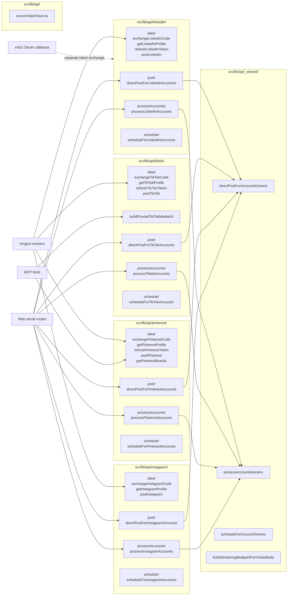
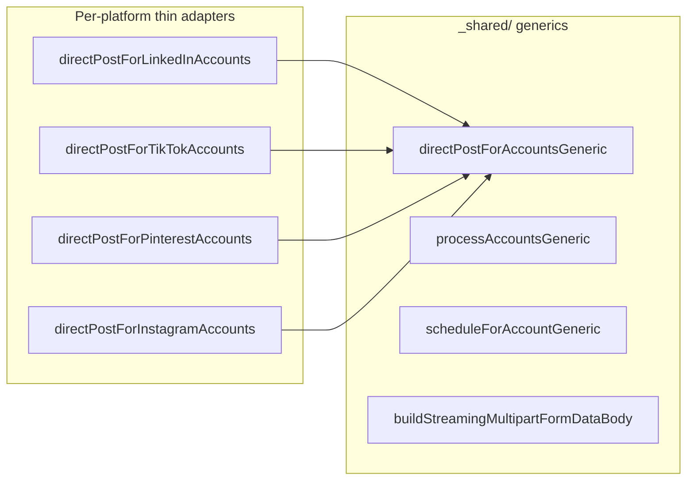

# Per-Platform Libraries

Documents `src/lib/api/` -- the per-platform integration code for LinkedIn, TikTok, Pinterest, and Instagram, plus the shared helpers in `_shared/`.

## Section 1: Library structure

## Section 2: Per-platform file inventory

### LinkedIn (`src/lib/api/linkedin/`)

| File | Purpose | External API | Env vars |
|---|---|---|---|
| `data/exchangeLinkedInCode.ts` | Exchange OAuth code for tokens | `POST https://www.linkedin.com/oauth/v2/accessToken` | `LINKEDIN_CLIENT_ID`, `LINKEDIN_CLIENT_SECRET`, `LINKEDIN_REDIRECT_URL` |
| `data/getLinkedInProfile.ts` | Fetch user profile after auth | `GET https://api.linkedin.com/v2/userinfo` | none |
| `data/refreshLinkedinToken.ts` | Refresh expired access token | `POST https://www.linkedin.com/oauth/v2/accessToken` (grant_type=refresh_token) | `LINKEDIN_CLIENT_ID`, `LINKEDIN_CLIENT_SECRET` |
| `data/postLinkedIn.ts` | Post text/image/video to LinkedIn | `POST /v2/assets`, `PUT uploadUrl`, `POST /v2/ugcPosts` | none |
| `processAccounts/processLinkedinAccounts.ts` | Schedule posts for selected accounts | none (delegates to `schedulePostInternal`) | none |
| `post/directPostForLinkedInAccounts.ts` | Direct post for selected accounts | none (delegates to generic) | none |
| `schedule/scheduleForLinkedInAccounts.ts` | Schedule adapter | none | none |

Callers of `exchangeLinkedInCode`: `src/app/api/social/linkedin/connect/route.ts:3`
Callers of `postLinkedIn`: `src/inngest/functions/processSinglePostHelpers.ts`, `src/inngest/functions/processDirectPostHelpers.ts`

### TikTok (`src/lib/api/tiktok/`)

| File | Purpose | External API | Env vars |
|---|---|---|---|
| `data/exchangeTikTokCode.ts` | Exchange OAuth code for tokens | `POST https://open.tiktokapis.com/v2/oauth/token/` | `TIKTOK_CLIENT_KEY`/`_DEV`, `TIKTOK_CLIENT_SECRET`/`_DEV`, `TIKTOK_REDIRECT_URL` |
| `data/getTikTokProfile.ts` | Fetch user profile | `GET https://open.tiktokapis.com/v2/user/info/` | none |
| `data/refreshTikTokToken.ts` | Refresh expired token | `POST https://open.tiktokapis.com/v2/oauth/token/` (grant_type=refresh_token) | `TIKTOK_CLIENT_KEY`/`_DEV`, `TIKTOK_CLIENT_SECRET`/`_DEV` |
| `data/postTikTok.ts` | Post image/video (async pull model) | `POST /v2/post/publish/content/init/` or `video/init/` | none |
| `buildProxiedTikTokMediaUrl.ts` | Build HMAC-signed media URL for TikTok pull | none | `MEDIA_PROXY_HMAC_SECRET`, `FRONTEND_URL`, `TIKTOK_MEDIA_SOURCE`, `SUPABASE_CUSTOM_STORAGE_DOMAIN` |
| `processAccounts/processTiktokAccounts.ts` | Schedule posts | none | none |
| `post/directPostForTikTokAccounts.ts` | Direct post | none | none |
| `schedule/scheduleForTikTokAccounts.ts` | Schedule adapter | none | none |

Dev/prod key split: `exchangeTikTokCode` and `refreshTikTokToken` switch between `TIKTOK_CLIENT_KEY` (prod) and `TIKTOK_CLIENT_KEY_DEV` (dev) based on `NODE_ENV`.

### Pinterest (`src/lib/api/pinterest/`)

| File | Purpose | External API | Env vars |
|---|---|---|---|
| `data/exchangePinterestCode.ts` | Exchange OAuth code (Basic Auth) | `POST https://api.pinterest.com/v5/oauth/token` | `PINTEREST_CLIENT_ID`, `PINTEREST_CLIENT_SECRET`, `PINTEREST_REDIRECT_URL` |
| `data/getPinterestProfile.ts` | Fetch user profile | `GET https://api.pinterest.com/v5/user_account` | none |
| `data/refreshPinterestToken.ts` | Refresh expired token | `POST https://api.pinterest.com/v5/oauth/token` (grant_type=refresh_token, Basic Auth) | `PINTEREST_CLIENT_ID`, `PINTEREST_CLIENT_SECRET` |
| `data/postPinterest.ts` | Post image/video pin | `POST /v5/pins` (image), `POST /v5/media` + S3 upload + `POST /v5/pins` (video) | none |
| `data/getPinterestBoards.ts` | List boards for account | `GET https://api.pinterest.com/v5/boards` | none |
| `processAccounts/processPinterestAccounts.ts` | Schedule posts | none | none |
| `post/directPostForPinterestAccounts.ts` | Direct post | none | none |
| `schedule/scheduleForPinterestAccounts.ts` | Schedule adapter | none | none |

Special: Pinterest token exchange uses **Basic Auth** header (`Authorization: Basic base64(client_id:client_secret)`) instead of form body params.

Pinterest video upload uses `buildStreamingMultipartFormDataBody` from `src/lib/api/_shared/buildStreamingMultipartFormDataBody.ts` for streaming multipart S3 upload (64KB chunks, avoids loading full video into memory).

### Instagram (`src/lib/api/instagram/`)

| File | Purpose | External API | Env vars |
|---|---|---|---|
| `data/exchangeInstagramCode.ts` | Two-phase token exchange | `POST https://api.instagram.com/oauth/access_token` then `GET https://graph.instagram.com/access_token?grant_type=ig_exchange_token` | `INSTAGRAM_CLIENT_ID`, `INSTAGRAM_CLIENT_SECRET`, `INSTAGRAM_REDIRECT_URL` |
| `data/getInstagramProfile.ts` | Fetch user profile | `GET https://graph.instagram.com/v23.0/me` | none |
| `data/postInstagram.ts` | Container model posting | `POST /{userId}/media`, poll `GET /{containerId}`, `POST /{userId}/media_publish` | none |
| `processAccounts/processInstagramAccounts.ts` | Schedule posts | none | none |
| `post/directPostForInstagramAccounts.ts` | Direct post | none | none |
| `schedule/scheduleForInstagramAccounts.ts` | Schedule adapter | none | none |

Special: Instagram does NOT have a `refreshInstagramToken` function. Long-lived tokens (60 days) expire without refresh. Re-authorization required. This is documented in the `ensureValidToken.ts` TODO at line 59.

### `ensureValidToken.ts` (`src/lib/api/ensureValidToken.ts`)

- Purpose: Check if a social account's token is expired and attempt refresh
- Calls: `refreshLinkedinToken`, `refreshTikTokToken`, `refreshPinterestToken` (per platform)
- Instagram: TODO comment at line 59 ("Instagram tokens (long-lived) last 60 days and need refresh")
- Callers: `processSinglePostHelpers`, `processDirectPostHelpers`, MCP `listPinterestBoards`

## Section 3: Cross-platform comparison

| Function | LinkedIn | TikTok | Pinterest | Instagram |
|---|---|---|---|---|
| Token exchange | `exchangeLinkedInCode` (form body auth) | `exchangeTikTokCode` (form body auth) | `exchangePinterestCode` (Basic Auth header) | `exchangeInstagramCode` (2-phase: short-lived then long-lived) |
| Profile fetch | `getLinkedInProfile` | `getTikTokProfile` | `getPinterestProfile` | `getInstagramProfile` |
| Token refresh | `refreshLinkedinToken` | `refreshTikTokToken` | `refreshPinterestToken` | **NOT IMPLEMENTED** (60-day token, no refresh) |
| Post text | `postLinkedIn` (supported) | **NOT SUPPORTED** (video/image only) | **NOT SUPPORTED** (image/video only) | **NOT SUPPORTED** (image/reel only) |
| Post image | `postLinkedIn` (register upload, PUT, then ugcPost) | `postTikTok` (photo_images URL array, async pull) | `postPinterest` (image_url in pin create) | `postInstagram` (container model) |
| Post video | `postLinkedIn` (register upload, POST, then ugcPost) | `postTikTok` (video_url, async pull + poll) | `postPinterest` (streaming S3 multipart + poll + pin create) | `postInstagram` (REELS container model) |
| Board/board-like | n/a | n/a | `getPinterestBoards` (required for posting) | n/a |
| Media delivery | Signed Supabase URL | HMAC proxy URL or direct Supabase | Signed Supabase URL | Signed Supabase URL |
| Post confirmation | Synchronous (returns post ID) | Async (publish_id, polled by tiktok-publish-status-poll) | Video: async poll, Image: synchronous | Container poll (3 attempts, 15s interval) |

### Gaps

- Instagram has no `refreshInstagramToken` -- by design (Instagram Login provides 60-day tokens with no refresh grant)
- LinkedIn is the only platform that supports text-only posts
- TikTok post model is fundamentally different (async pull vs direct upload)
- Pinterest video upload requires the streaming multipart helper (unique complexity)

## Section 3a: Complete file inventory (43 files)

### LinkedIn (7 files)

| File | Lines | Purpose |
|---|---|---|
| `data/exchangeLinkedInCode.ts` | ~113 | Exchange OAuth code for tokens. Hardcodes `LINKEDIN_REDIRECT_URL`. |
| `data/getLinkedInProfile.ts` | ~40 | Fetch user profile from `/v2/userinfo`. |
| `data/refreshLinkedinToken.ts` | ~80 | Refresh expired access token via refresh_token grant. |
| `post/postToLinkedIn.ts` | ~180 | Main posting function: register upload, PUT binary, POST ugcPost. |
| `post/directPostForLinkedInAccounts.ts` | ~30 | Thin wrapper over `directPostForAccountsGeneric`. |
| `processAccounts/processLinkedinAccounts.ts` | ~30 | Thin wrapper over `processAccountsGeneric`. |
| `schedule/scheduleForLinkedInAccounts.ts` | ~30 | Thin wrapper over `scheduleForAccountGeneric`. |

### TikTok (13 files)

| File | Lines | Purpose |
|---|---|---|
| `data/exchangeTikTokCode.ts` | ~118 | Exchange OAuth code. Dev/prod key split on `NODE_ENV`. |
| `data/getTikTokProfile.ts` | ~60 | Fetch user profile. Handles `scope_not_authorized` fallback. |
| `data/getTikTokCreatorInfo.ts` | ~50 | Query `/v2/post/publish/creator_info/query/` for privacy options. |
| `data/refreshTikTokToken.ts` | ~80 | Refresh expired token. Dev/prod key split. |
| `buildTikTokMediaUrl.ts` | ~30 | Dispatcher: routes to proxy or direct URL builder. |
| `buildProxiedTikTokMediaUrl.ts` | ~60 | Build HMAC-signed `/api/media` URL for TikTok pull model. |
| `buildSupabaseDirectTikTokMediaUrl.ts` | ~30 | Build direct Supabase Storage URL (requires custom domain). |
| `getTikTokPublishStatus.ts` | ~40 | Query publish status for a TikTok publish_id. |
| `post/postToTikTok.ts` | ~120 | Main posting: creator info query, then content/init or video/init. |
| `post/postImage.ts` | ~50 | TikTok image post via photo_images array (async pull). |
| `post/postVideo.ts` | ~60 | TikTok video post via video_url (async pull + cover_timestamp_ms). |
| `post/directPostForTikTokAccounts.ts` | ~30 | Thin wrapper. |
| `processAccounts/processTiktokAccounts.ts` | ~30 | Thin wrapper. |

### Pinterest (10 files)

| File | Lines | Purpose |
|---|---|---|
| `data/exchangePinterestCode.ts` | ~117 | Exchange code. Uses **Basic Auth** header (unique among platforms). |
| `data/getPinterestProfile.ts` | ~40 | Fetch user profile from `/v5/user_account`. |
| `data/getPinterestBoards.ts` | ~50 | List boards for account. Used by MCP `list_pinterest_boards` tool. |
| `data/createPinterestBoard.ts` | ~40 | Create a new board. Used by web UI board creation. |
| `data/refreshPinterestToken.ts` | ~80 | Refresh token. Basic Auth header. |
| `post/postToPinterest.ts` | ~150 | Main posting: image URL or video (streaming multipart S3 upload + poll). |
| `post/postImage.ts` | ~40 | Pinterest image pin creation via `POST /v5/pins` with image_url. |
| `post/createVideoPin.ts` | ~100 | Video: register media, streaming S3 upload, poll status, create pin. |
| `post/directPostForPinterestAccounts.ts` | ~30 | Thin wrapper. |
| `processAccounts/processPinterestAccounts.ts` | ~30 | Thin wrapper. |

### Instagram (6 files)

| File | Lines | Purpose |
|---|---|---|
| `data/exchangeInstagramCode.ts` | ~238 | Two-phase: short-lived token then `ig_exchange_token` for 60-day long-lived. |
| `data/getInstagramProfile.ts` | ~40 | Fetch profile from Graph API v23. |
| `post/postToInstagram.ts` | ~130 | Container model: create container, poll status, publish, get shortcode. |
| `post/directPostForInstagramAccounts.ts` | ~30 | Thin wrapper. |
| `processAccounts/processInstagramAccounts.ts` | ~30 | Thin wrapper. |
| `schedule/scheduleForInstagramAccounts.ts` | ~30 | Thin wrapper. |

### Shared (5 files)

| File | Lines | Purpose |
|---|---|---|
| `_shared/directPostForAccountsGeneric.ts` | ~80 | Generic direct-post: insert pending_direct_posts, dispatch Inngest post.now events. |
| `_shared/processAccountsGeneric.ts` | ~60 | Generic schedule: loop accounts, call schedulePostInternal per account. |
| `_shared/scheduleForAccountGeneric.ts` | ~40 | Generic schedule adapter. |
| `_shared/buildStreamingMultipartFormDataBody.ts` | ~200 | Streaming multipart for Pinterest S3 upload (64KB chunks). |
| `ensureValidToken.ts` | ~80 | Check token expiry, attempt refresh. Instagram TODO at line 59. |

### Summary

| Platform | Files | Total LOC (approx) | Has refresh? | Post types |
|---|---|---|---|---|
| LinkedIn | 7 | ~500 | Yes | text, image, video |
| TikTok | 13 | ~750 | Yes | image, video (no text) |
| Pinterest | 10 | ~680 | Yes | image, video (no text) |
| Instagram | 6 | ~500 | No (60-day token) | image, reel (no text) |
| Shared | 5 | ~460 | n/a | n/a |
| **Total** | **41** + ensureValidToken | **~2,890** | | |

## Section 4: Shared generic helpers

`src/lib/api/_shared/` contains:

| File | Purpose | Callers |
|---|---|---|
| `directPostForAccountsGeneric.ts` | Generic direct-post adapter: dispatches Inngest `post.now` events, inserts `pending_direct_posts` rows | All 4 `directPostFor{Platform}Accounts` |
| `processAccountsGeneric.ts` | Generic multi-account processor: loops over accounts, calls `schedulePostInternal` per account | All 4 `process{Platform}Accounts` |
| `scheduleForAccountGeneric.ts` | Generic schedule adapter | All 4 `scheduleFor{Platform}Accounts` |
| `buildStreamingMultipartFormDataBody.ts` | Streaming multipart form-data builder for Pinterest video S3 upload (64KB chunks) | `postPinterest` (video path only) |

The generic helpers handle the shared logic (auth check, batch_id generation, Inngest dispatch, pending_direct_posts insertion). The per-platform files provide platform-specific configuration (post type validation, Pinterest board requirement, TikTok cover timestamp).

[Back to Index](./00_INDEX.md) | [Previous: Shared Actions](./05_SHARED_INTERNAL_ACTIONS.md) | [Next: DB Touches](./07_DB_TOUCHES_PER_SURFACE.md)
