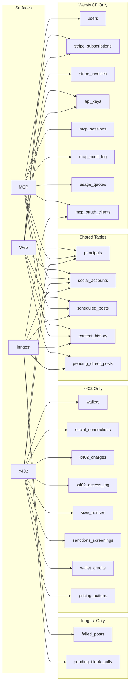
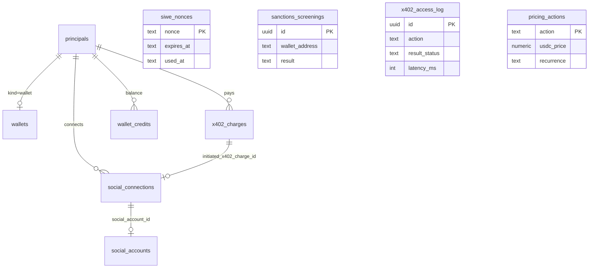

# DB Touches Per Surface

Maps every database table to which surface reads and writes it, with code citations.

## Section 1: Table matrix

| Table | Web reads | Web writes | MCP reads | MCP writes | x402 reads | x402 writes | Inngest reads | Inngest writes |
|---|---|---|---|---|---|---|---|---|
| `principals` | yes | yes (ensureUserExists) | yes (auth resolve) | no | yes (resolveWalletPrincipal) | yes (register_wallet_atomic) | no | no |
| `users` | yes | yes (Clerk webhook) | no | no | no | no | no | no |
| `wallets` | no | no | no | no | yes (resolveWalletPrincipal) | yes (register_wallet_atomic) | no | no |
| `social_accounts` | yes | yes (OAuth callbacks) | yes (tools) | no | yes (connect verify) | yes (OAuth callback) | yes (worker) | no |
| `social_connections` | no | no | no | no | yes (status poll) | yes (connect_wallet_atomic, callback) | no | no |
| `scheduled_posts` | yes | yes (schedulePostInternal) | yes (list, get) | yes (schedule, cancel, resume, delete, reschedule) | no | no (Phase 4.3) | yes (tick, worker) | yes (status updates) |
| `failed_posts` | yes | no | no | no | no | no | no | yes (INSERT on failure) |
| `content_history` | yes | yes (storeContentHistory) | yes (list) | no | no | no | no | yes (INSERT on success) |
| `pending_direct_posts` | yes (status poll) | yes (direct post) | no | yes (post_now, bulk_post_now) | no | no | yes (worker) | yes (finalize) |
| `pending_tiktok_pulls` | no | no | no | no | no | no | yes (poll) | yes (INSERT, update) |
| `stripe_subscriptions` | yes | yes (webhook) | yes (auth resolve) | no | no | no | no | no |
| `stripe_invoices` | no | yes (webhook) | no | no | no | no | no | no |
| `usage_quotas` | no | no | yes (entitlement) | yes (atomic_increment) | no | no | no | no |
| `platform_quotas` | no | no | yes (entitlement) | no | no | no | no | no |
| `api_keys` | yes (CRUD UI) | yes (create, revoke) | yes (auth resolve) | yes (last_used_at update) | no | no | no | no |
| `mcp_sessions` | no | no | yes (audit) | yes (upsert per request) | no | no | no | no |
| `mcp_audit_log` | no | no | no | yes (INSERT, append-only) | no | no | no | no |
| `mcp_oauth_clients` | no | no | yes (auth resolve) | yes (INSERT/UPDATE trust) | no | no | no | yes (sweep stale) |
| `analytics_metrics` | no | no | yes (get_account_analytics) | no | no | no | no | no |
| `x402_charges` | no | no | no | no | yes (idempotent check) | yes (register/connect atomic) | no | no |
| `x402_access_log` | no | no | no | no | no | yes (logX402Call, append-only) | no | no |
| `x402_refunds` | no | no | no | no | no | yes (on refund) | no | no |
| `siwe_nonces` | no | no | no | no | yes (consume) | yes (create) | no | no |
| `sanctions_screenings` | no | no | no | no | no | yes (register atomic, append-only) | no | no |
| `wallet_credits` | no | no | no | no | yes (balance check) | yes (register atomic) | no | no |
| `wallet_credits_ledger` | no | no | no | no | no | yes (future, append-only) | no | no |
| `pricing_actions` | no | no | no | no | yes (challenge) | no | no | no |
| `rate_limit_events` | no | no | no | yes (DCR registration) | no | no | no | no |
| `usdc_fmv_daily` | no | no | no | no | no | no (not populated) | no | no |

## Section 2: Surface-to-table diagram

## Section 3: x402-only tables

These tables are ONLY touched by x402 code:

| Table | x402 reads | x402 writes | Code location |
|---|---|---|---|
| `wallets` | `resolveWalletPrincipal` | `register_wallet_atomic` RPC | `src/lib/x402/auth/resolveWalletPrincipal.ts`, `src/lib/x402/register/insertRegisterAtomic.ts` |
| `siwe_nonces` | `consumeSiweNonce` | `createSiweNonce` | `src/lib/x402/siwe/consumeSiweNonce.ts`, `src/lib/x402/siwe/createSiweNonce.ts` |
| `x402_charges` | idempotent check in verify | `register_wallet_atomic`, `connect_wallet_atomic` | `src/lib/x402/register/handleRegisterVerify.ts`, `src/lib/x402/connect/insertConnectAtomic.ts` |
| `x402_access_log` | never | `logX402Call` (append-only) | `src/lib/x402/audit/logX402Call.ts` |
| `x402_refunds` | never | on refund (append-only) | `src/lib/x402/facilitator.ts` (refundPayment) |
| `sanctions_screenings` | never | `register_wallet_atomic` (append-only) | `src/lib/x402/register/insertRegisterAtomic.ts` |
| `wallet_credits` | balance check | `register_wallet_atomic` (initial 0) | `src/lib/x402/auth/resolveWalletPrincipal.ts` |
| `wallet_credits_ledger` | never | future (append-only) | not yet written to |
| `pricing_actions` | challenge price lookup | never | `src/lib/x402/register/handleRegisterChallenge.ts`, `src/lib/x402/connect/handleConnectChallenge.ts` |
| `social_connections` | status poll | connect_wallet_atomic, callback update | `src/lib/x402/oauth/status/handleStatusQuery.ts`, `src/lib/x402/connect/insertConnectAtomic.ts`, `src/lib/x402/oauth/callback/handleOAuthCallback.ts` |
| `usdc_fmv_daily` | never | never (not populated) | schema only |

## Section 4: Web/MCP-only tables

| Table | Surface | Code location |
|---|---|---|
| `users` | Web (Clerk webhook) | `src/app/api/webhooks/clerk/route.ts`, `src/actions/server/ensureUserExists.ts` |
| `stripe_invoices` | Web (Stripe webhook, append-only) | `src/app/api/webhooks/stripe/route.ts` |
| `api_keys` | Web (CRUD) + MCP (auth resolve) | `src/actions/server/mcp/createApiKey.ts`, `src/lib/mcp/auth/resolvers/apiKey.ts` |
| `mcp_sessions` | MCP (upsert per request) | `src/lib/mcp/audit.ts` |
| `mcp_audit_log` | MCP (append-only) | `src/lib/mcp/audit.ts` |
| `usage_quotas` | MCP (atomic increment) | `src/lib/mcp/entitlement.ts` |
| `mcp_oauth_clients` | MCP (trust enforcement) + Inngest (sweep stale) | `src/lib/mcp/auth/oauthClientTrust.ts`, `src/inngest/functions/sweepStaleOauthClientsCron.ts` |
| `analytics_metrics` | MCP (read by get_account_analytics) | `src/lib/mcp/tools/getAccountAnalytics.ts` |

## Section 5: Shared tables (touched by 2+ surfaces)

| Table | Surfaces | Notes |
|---|---|---|
| `principals` | Web, MCP, x402 | Web/MCP: `kind=clerk`. x402: `kind=wallet`. |
| `social_accounts` | Web, MCP, x402, Inngest | All surfaces read. Web + x402 write (OAuth callbacks). |
| `scheduled_posts` | Web, MCP, Inngest | Web + MCP write (schedule). Inngest writes (status transitions). x402 Phase 4.3 will write. |
| `content_history` | Web, MCP, Inngest | Web reads. MCP reads. Inngest writes (on post success). |
| `pending_direct_posts` | Web, MCP, Inngest | Web + MCP write (insert lock row). Inngest writes (finalize). |
| `stripe_subscriptions` | Web, MCP | Web writes (webhook). MCP reads (auth resolve). |

## Section 6: Postgres RPC functions

| RPC | Purpose | Called by |
|---|---|---|
| `atomic_increment_quota` | Atomically increment `usage_quotas.count`, prevent race conditions | `src/lib/mcp/entitlement.ts` (MCP only) |
| `get_user_storage_bytes` | Return total bytes for a principal in a bucket | `src/lib/mcp/_shared/enforceStorageQuota.ts` (MCP + Web upload) |
| `register_wallet_atomic` | Atomic INSERT: principals + wallets + sanctions + x402_charges + wallet_credits | `src/lib/x402/register/insertRegisterAtomic.ts` (x402 only) |
| `connect_wallet_atomic` | Atomic INSERT: social_connections + x402_charges | `src/lib/x402/connect/insertConnectAtomic.ts` (x402 only) |

## Section 7: ER diagram for x402 tables

## Section 8: Inngest function inventory (DB perspective)

8 Inngest functions registered at `src/app/api/inngest/route.ts`:

| Function | Trigger | DB reads | DB writes |
|---|---|---|---|
| `scheduled-posts-tick` | Cron `*/5 * * * *` | `scheduled_posts` (due posts) | `scheduled_posts` (status=queued) |
| `process-single-post` | Event `post.due` | `scheduled_posts`, `social_accounts` | `scheduled_posts` (status=posted/failed), `content_history`, `failed_posts` |
| `process-direct-post` | Event `post.now` | `social_accounts`, `pending_direct_posts` | `pending_direct_posts` (status=completed/failed), `content_history` |
| `tiktok-publish-status-poll` | Event `tiktok.publish.poll` | `pending_tiktok_pulls`, `social_accounts` | `pending_tiktok_pulls` (status, attempt_count), `content_history` |
| `sweep-stuck-direct-posts` | Cron `*/5 * * * *` | `pending_direct_posts` (stuck rows) | `pending_direct_posts` (status=failed) |
| `sweep-orphan-storage-files` | Cron `0 3 * * *` | `scheduled_posts`, `failed_posts`, `pending_tiktok_pulls`, `pending_direct_posts` (reference check) | Supabase Storage (file deletion) |
| `cleanup-cancelled-posts-after-grace` | Cron `0 5 * * *` | `scheduled_posts` (cancelled by sub), `stripe_subscriptions` | `scheduled_posts` (DELETE) |
| `sweep-stale-oauth-clients` | Cron `0 4 * * *` | `mcp_oauth_clients`, `mcp_sessions` | `mcp_oauth_clients` (DELETE stale) |

## Section 9: Append-only tables

Six tables block UPDATE operations at the database layer:

| Table | Surface that writes | Insert location |
|---|---|---|
| `mcp_audit_log` | MCP | `src/lib/mcp/audit.ts` (logToolCall) |
| `stripe_invoices` | Web (Stripe webhook) | `src/app/api/webhooks/stripe/route.ts` |
| `wallet_credits_ledger` | x402 (future) | Not yet written to |
| `x402_access_log` | x402 | `src/lib/x402/audit/logX402Call.ts` |
| `x402_refunds` | x402 (on refund) | `src/lib/x402/facilitator.ts` (refundPayment) |
| `sanctions_screenings` | x402 (register) | `src/lib/x402/register/insertRegisterAtomic.ts` |

These tables have `Update: never` in `src/lib/types/database.types.ts`. Any attempt to UPDATE via the Supabase client will fail. This ensures financial and audit records are tamper-proof.

[Back to Index](./00_INDEX.md) | [Previous: Per-Platform Libs](./06_PER_PLATFORM_LIBS.md) | [Next: Imports Map](./08_IMPORTS_MAP.md)
