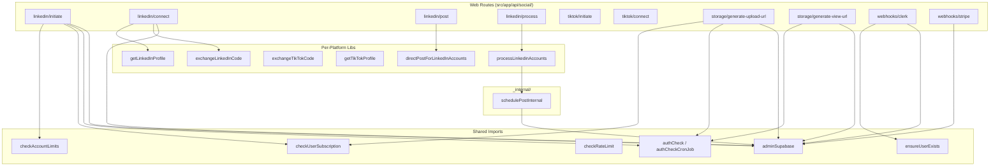

# Imports Map

Cross-reference of who imports what across the 3 surfaces and shared layers.

## Section 1: Most-imported files

Counted via `grep -rn "from.*<module>" src/ | wc -l` (excluding node_modules):

| File | Import count | Top callers |
|---|---|---|
| `@/actions/api/adminSupabase` | 67+ | Every route handler, MCP tool, x402 lib, Inngest function, server action |
| `@/lib/types/database.types` | 30+ | Type imports across all surfaces |
| `@/actions/server/_internal/scheduleActions/schedulePost` | 6 | MCP schedule_post, bulk_schedule; Web process routes (4 platforms) |
| `@/actions/server/_internal/data/fetchSocialAccounts` | 4 | MCP list_connections, connections resource; Web routes |
| `@/actions/server/_internal/contentHistoryActions/getContentHistory` | 4 | MCP list_content_history, content-history resource; Web routes |
| `@/actions/server/_internal/scheduleActions/getScheduledPosts` | 4 | MCP list_scheduled_posts, scheduled-posts resource; Web routes |
| `@/actions/server/_internal/scheduleActions/cancelScheduledPostBatch` | 2 | MCP cancel_scheduled_posts; Web cancelScheduledPost |
| `@/actions/server/_internal/scheduleActions/resumeScheduledPostBatch` | 2 | MCP resume_scheduled_posts; Web resumeScheduledPost |
| `@/actions/server/_internal/scheduleActions/deleteScheduledPostBatch` | 2 | MCP delete_scheduled_posts; Web deleteScheduledPost |
| `@/actions/server/_internal/scheduleActions/updateScheduledTimeBatch` | 2 | MCP reschedule_posts; Web updateScheduledTime |
| `@/lib/mcp/audit` | 20+ | Every MCP tool (via logToolCall) |
| `@/lib/mcp/entitlement` | 18+ | Every MCP tool (via entitlementFor) |
| `@/lib/mcp/context` | 20+ | MCP tools, x402 routes (extractIpHash, extractUserAgent) |
| `@/actions/server/rateLimit/checkRateLimit` | 10+ | MCP tools, web actions, x402 routes |
| `@/lib/api/tiktok/buildProxiedTikTokMediaUrl` | 2 | MCP post_now, bulk_post_now |
| `@/lib/mcp/ipHash` | 3 | MCP context.ts, x402 audit |
| `@/lib/types/plans` | 8+ | entitlement.ts, checkAccountLimits, enforceStorageQuota |

## Section 2: Web surface import graph

## Section 3: MCP surface import graph

```mermaid
graph TD
    subgraph MCPRoute["MCP Transport"]
        Route["route.ts:41"]
    end

    subgraph MCPAuth["Auth Layer"]
        Resolve["resolveMcpPrincipal"]
        ApiKey["resolvers/apiKey.ts"]
        OAuth["resolvers/oauth.ts"]
        Trust["oauthClientTrust.ts"]
    end

    subgraph MCPTools["Tools (18)"]
        SP["schedule_post"]
        PN["post_now"]
        BS["bulk_schedule"]
        BPN["bulk_post_now"]
        CSP["cancel_scheduled_posts"]
        RSP["resume_scheduled_posts"]
        DSP["delete_scheduled_posts"]
        ReSP["reschedule_posts"]
        AMA["attach_media_from_url"]
        RUU["request_upload_url"]
        LC["list_connections"]
        LSP["list_scheduled_posts"]
        LCH["list_content_history"]
        LPB["list_pinterest_boards"]
        LBS["list_billing_summary"]
        RAL["request_account_reauth_link"]
        GAA["get_account_analytics"]
        GPD["generate_post_draft"]
    end

    subgraph SharedLayer["Shared Layer"]
        SPI["schedulePostInternal"]
        CSPBI["cancelBatchInternal"]
        RSPBI["resumeBatchInternal"]
        DSPBI["deleteBatchInternal"]
        USTBI["updateTimeBatchInternal"]
        GSPI["getScheduledPostsInternal"]
        GCHI["getContentHistoryInternal"]
        FSAI["fetchSocialAccountsInternal"]
        AS["adminSupabase"]
        Ent["entitlementFor"]
        Audit["logToolCall"]
        SUF["safeUserFetch"]
        ESQ["enforceStorageQuota"]
    end

    Route --> Resolve
    Resolve --> ApiKey & OAuth & Trust
    ApiKey --> AS
    Trust --> AS

    SP --> SPI & Ent & Audit & AS
    PN --> AS & Ent & Audit
    BS --> SPI & Ent & Audit & AS
    CSP --> CSPBI & Ent & Audit
    RSP --> RSPBI & Ent & Audit
    DSP --> DSPBI & Ent & Audit
    ReSP --> USTBI & Ent & Audit
    LC --> FSAI & Ent & Audit
    LSP --> GSPI & Ent & Audit
    LCH --> GCHI & Ent & Audit
    AMA --> SUF & ESQ & Ent & Audit & AS
    RUU --> ESQ & Ent & Audit & AS
    LPB --> AS & Ent & Audit
```

## Section 4: x402 surface import graph

```mermaid
graph TD
    subgraph X402Routes["x402 Routes"]
        Reg["register/route.ts"]
        Con["connect/route.ts"]
        CB["oauth/callback/[platform]/route.ts"]
        Stat["oauth/status/route.ts"]
    end

    subgraph X402Lib["x402 Lib"]
        HRC["handleRegisterChallenge"]
        HRV["handleRegisterVerify"]
        HRSV["handleRegisterSolanaVerify"]
        IRA["insertRegisterAtomic"]
        HCC["handleConnectChallenge"]
        HCV["handleConnectVerify"]
        ICA["insertConnectAtomic"]
        BOA["buildOAuthUrl"]
        HOC["handleOAuthCallback"]
        HSQ["handleStatusQuery"]
        VSA["verifySiweAuth"]
        CSN["createSiweNonce"]
        CON["consumeSiweNonce"]
        RWP["resolveWalletPrincipal"]
        AWG["applyWalletGate"]
        FAC["facilitator"]
        NET["networks"]
        LOG["logX402Call"]
        BER["buildErrorResponse"]
        BPR["buildPaymentRequiredResponse"]
        BSR["buildSuccessResponse"]
    end

    subgraph SharedImports["Shared Imports"]
        AS["adminSupabase"]
        RL["checkRateLimit"]
        IPH["extractIpHash"]
        UA["extractUserAgent"]
    end

    Reg --> HRC & HRV & HRSV & VSA & FAC & NET & LOG & BER & BPR & BSR & RL & IPH & UA
    Con --> HCC & HCV & VSA & FAC & NET & LOG & BER & BPR & BSR & BOA & RL & IPH & UA
    CB --> HOC & LOG
    Stat --> HSQ & RL

    HRC --> AS & CSN & NET
    HRV --> AS & CON & FAC & IRA & AWG & RWP
    HCV --> AS & CON & FAC & ICA & RWP
    HOC --> AS
    HSQ --> AS

    IRA --> AS
    ICA --> AS
    RWP --> AS
    AWG --> AS
    LOG --> AS
```

## Section 5: Orphan file analysis

Files in `src/lib/` and `src/actions/` that may have zero importers (candidates for review):

| File | Last commit | Notes |
|---|---|---|
| `src/lib/x402/solana/refundSolana.ts` | Phase 4.1 | Stub returning `facilitator_error`. Imported by `facilitator.ts` but returns stub. |
| `src/lib/x402/oauth/connectionToken.ts` | Phase 4.2 | May be used by connect flow for signed tokens. |
| `src/lib/x402/oauth/state.ts` | Phase 4.2 | State management helper for x402 OAuth. |
| `src/inngest/functions/platformErrors.ts` | Recent | Imported by processSinglePost and processDirectPost helpers. Not orphaned. |

Note: A comprehensive orphan scan would require iterating all files and checking import counts. The files above were flagged during manual review. Most files in the codebase are well-connected.

## Section 6: Import patterns by surface

| Pattern | Web | MCP | x402 |
|---|---|---|---|
| Auth import | `@clerk/nextjs/server` (auth) | `@/lib/mcp/auth` (resolveMcpPrincipal) | `@/lib/x402/auth/resolveWalletPrincipal` |
| DB client | `@/actions/api/adminSupabase` | `@/actions/api/adminSupabase` | `@/actions/api/adminSupabase` |
| Rate limit | `@/actions/server/rateLimit/checkRateLimit` | `@/actions/server/rateLimit/checkRateLimit` | `@/actions/server/rateLimit/checkRateLimit` |
| Business logic | `@/actions/server/_internal/*` | `@/actions/server/_internal/*` | Not yet (Phase 4.3) |
| Audit | None (no MCP-style audit) | `@/lib/mcp/audit` (logToolCall) | `@/lib/x402/audit/logX402Call` |
| IP hash | Not used | `@/lib/mcp/context` (extractIpHash) | `@/lib/mcp/context` (extractIpHash) |
| Platform libs | `@/lib/api/{platform}/data/*` (OAuth exchange, profile) | `@/lib/api/{platform}/data/*` (boards, buildProxiedUrl) | `@/lib/x402/oauth/callback/*` (separate token exchange) |

Key observation: `adminSupabase` and `checkRateLimit` are the two truly universal imports used by all 3 surfaces. The `_internal/` actions are shared between Web and MCP but not yet used by x402.

[Back to Index](./00_INDEX.md) | [Previous: DB Touches](./07_DB_TOUCHES_PER_SURFACE.md) | [Next: Duplication Analysis](./09_DUPLICATION_ANALYSIS.md)
