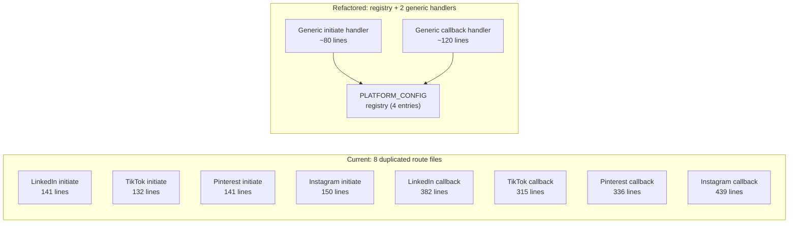

# Duplication Analysis

The opinionated file: identifies code duplication and refactor candidates, ordered by ROI.

## Section 1: OAuth flow duplication

The most significant duplication in the codebase. Documented in detail by `change/RECON_X402_PHASE_4_2.md:166-198`.

### Initiate routes (4 files, ~550 lines total)

All 4 initiate routes (`src/app/api/social/{platform}/initiate/route.ts`) share identical logic for:

| Step | Lines per platform | Total | Extractable |
|---|---|---|---|
| Clerk auth() + reject if !userId | 10 | 40 | YES (identical) |
| checkActiveSubscription | 10 | 40 | YES (identical) |
| checkAccountLimits | 25 | 100 | YES (identical) |
| Count existing accounts for platform | 6 | 24 | YES (template with platform param) |
| Generate state (nanoid(32)) | 1 | 4 | YES (identical) |
| Set httpOnly cookie (15min) | 7 | 28 | YES (identical except cookie name) |
| Build OAuth URL | 10 | 40 | PARTIAL (URL construction per platform) |
| Return JSON response | 5 | 20 | YES (identical) |

LinkedIn initiate: `src/app/api/social/linkedin/initiate/route.ts` (141 lines)
TikTok initiate: `src/app/api/social/tiktok/initiate/route.ts` (132 lines)
Pinterest initiate: `src/app/api/social/pinterest/initiate/route.ts` (141 lines)
Instagram initiate: `src/app/api/social/instagram/initiate/route.ts` (150 lines)

### Callback routes (4 files, ~1,470 lines total)

All 4 callback routes (`src/app/api/social/{platform}/connect/route.ts`) share:

| Step | Lines per platform | Total | Extractable |
|---|---|---|---|
| Clerk auth() check | 10 | 40 | YES |
| State cookie validation | 15 | 60 | YES (identical except cookie name) |
| Cookie deletion | 5 | 20 | YES |
| Token exchange call | 5 | 20 | NO (per-platform function) |
| Profile fetch call | 5 | 20 | NO (per-platform function) |
| DB upsert social_accounts | 40 | 160 | YES (identical upsert shape) |
| HTML popup response | 15 | 60 | YES (identical except function name) |

LinkedIn callback: `src/app/api/social/linkedin/connect/route.ts` (382 lines)
TikTok callback: `src/app/api/social/tiktok/connect/route.ts` (315 lines)
Pinterest callback: `src/app/api/social/pinterest/connect/route.ts` (336 lines)
Instagram callback: `src/app/api/social/instagram/connect/route.ts` (439 lines)

### x402 OAuth: separate but structurally similar

Phase 4.2 added `src/lib/x402/connect/buildOAuthUrl.ts` (switch on platform) and `src/lib/x402/oauth/callback/handleOAuthCallback.ts` (shared callback handler) plus 4 per-platform token exchange files. This is a second implementation of OAuth that does NOT share code with the Web OAuth routes because:
- Web uses Clerk session auth; x402 uses DB-backed state
- Web returns HTML popup; x402 returns JSON or redirect
- Web hardcodes `LINKEDIN_REDIRECT_URL` etc.; x402 uses `/api/x402/oauth/callback/[platform]`

### Registry refactor visualization



**Estimate:** 8 files (~2,030 lines) reduced to 3 files (~300 lines) + 4 thin platform config objects (~100 lines). Net savings: ~1,630 lines, 5 files removed.

## Section 2: Other duplication patterns

### Process route boilerplate

All 4 process routes (`/api/social/{platform}/process/route.ts`) are 53 lines each with identical structure:
- `authCheckCronJob(body.userId, body.cronSecret)`
- Delegate to `process{Platform}Accounts`
- Return JSON result

These could be a single generic route with a platform parameter, but the savings (~150 lines, 3 files) are modest.

### Token exchange redirect URI hardcoding

Each platform's `exchange{Platform}Code.ts` hardcodes a redirect URI from env:
- `LINKEDIN_REDIRECT_URL` in `exchangeLinkedInCode.ts`
- `TIKTOK_REDIRECT_URL` in `exchangeTikTokCode.ts`
- `PINTEREST_REDIRECT_URL` in `exchangePinterestCode.ts`
- `INSTAGRAM_REDIRECT_URL` in `exchangeInstagramCode.ts`

The x402 OAuth callback cannot reuse these functions because it needs different redirect URIs. Phase 4.2 created separate token exchange files (`src/lib/x402/oauth/callback/{platform}TokenExchange.ts`) with x402-specific redirect URIs. This is a direct consequence of the hardcoded URIs.

A refactor to pass `redirectUri` as a parameter would allow both Web and x402 to share token exchange code.

### Audit log boilerplate (MCP)

Every MCP tool has this pattern at the end:
```
logToolCall(principal, toolName, resultStatus, latencyMs, args, sessionId, ipHash, userAgent)
```

This is factored into `logToolCall` so the boilerplate is just the call site. The 18 repeated calls are minimal (1 line each). Not worth further abstraction.

### Rate limit boilerplate

MCP tools with rate limits repeat:
```
const rl = await checkRateLimit(scope, principal.principalId, limit, window);
if (!rl.success) return { content: [...], isError: true };
```

Only 2 tools (`attach_media_from_url` at 10/60s, `request_upload_url` at 20/60s) have rate limits. Not enough repetition to justify abstraction.

## Section 3: Recommended refactors (ordered by ROI)

### Refactor #1: Platform OAuth registry

- **Current:** 4 initiate routes + 4 callback routes = 8 files, ~2,030 lines
- **Refactored:** 1 platform config registry + 1 generic initiate handler + 1 generic callback handler = 3 files, ~400 lines
- **LOC saved:** ~1,630
- **Files removed:** 5 (4 initiate + reduce 4 callbacks to 1 generic + 4 thin configs)
- **Risk:** Medium (touches stable, shipped web routes)
- **Recommended phase:** Phase 4.7 (after x402 V1 ships and stabilizes)
- **Dependencies:** If token exchange functions accept a `redirectUri` parameter, x402 OAuth can also use them

### Refactor #2: Shared token exchange with parameterized redirect URI

- **Current:** 8 token exchange functions (4 Web in `src/lib/api/`, 4 x402 in `src/lib/x402/oauth/callback/`)
- **Refactored:** 4 token exchange functions that accept `redirectUri` as a parameter
- **LOC saved:** ~400 (4 x402 token exchange files eliminated)
- **Files removed:** 4
- **Risk:** Low (x402 token exchange files are new, Web exchange files get an added parameter)
- **Recommended phase:** Phase 4.7

### Refactor #3: Generic process route

- **Current:** 4 identical 53-line process routes
- **Refactored:** 1 generic route with platform parameter
- **LOC saved:** ~160
- **Files removed:** 3
- **Risk:** Low
- **Recommended phase:** Anytime

## Section 4: Over-engineering candidates

| Pattern | Location | Issue |
|---|---|---|
| `processAccountsGeneric` | `src/lib/api/_shared/processAccountsGeneric.ts` | Has 4 callers (one per platform). Justified since it extracts real shared logic (batch_id, loop, schedulePostInternal delegation). NOT over-engineered. |
| `buildStreamingMultipartFormDataBody` | `src/lib/api/_shared/buildStreamingMultipartFormDataBody.ts` | Only 1 caller (Pinterest video upload). But the complexity is necessary (Content-Length precomputation for multipart streams). Justified. |
| `RUNTIME` config | `src/lib/jobs/runtimeConfig.ts` | 14 configuration values with env overrides. Most are used. `directPostStatusPollIntervalMs` and `directPostStatusPollMaxAttempts` may be unused since commit `6281f6b` switched to DB polling. Verify. |
| `mcp_sessions` tracking | `src/lib/mcp/audit.ts` | Session IDs are synthetic (per-request UUIDs). mcp-handler 1.1.0 stateless mode means no real sessions. The upserts still provide client identification data. Marginal utility. |

## Section 5: Tech debt registry

All TODO/FIXME/deferred comments found via `grep -rn "TODO\|FIXME\|XXX\|HACK\|deferred" src/`:

| Location | Comment | Priority |
|---|---|---|
| `src/lib/api/ensureValidToken.ts:59` | `TODO(future): Instagram tokens (long-lived) last 60 days and need refresh` | Medium (Instagram re-auth required every 60 days, no auto-refresh) |
| `src/lib/x402/solana/refundSolana.ts` | Returns `facilitator_error` stub with `console.warn` | Medium (Solana refunds not implemented, manual processing required) |
| `scheduled_posts` stuck in `processing` | No sweep cron for scheduled posts (only `pending_direct_posts` has a sweep) | Low (rare: requires Inngest worker crash during processing) |
| `analytics_metrics` table | Exists but no cron populates it. `get_account_analytics` reads empty data. | Low (feature placeholder) |
| `@upstash/qstash` dependency | Listed in `package.json` but never imported | Low (dead dependency, safe to remove) |
| `social_accounts.access_token` plaintext | Tokens stored unencrypted in DB | High security (flagged in RECON_X402_PHASE_4_2.md, separate security phase recommended) |
| `usdc_fmv_daily` table | Schema exists, never populated | Low (x402 Phase 4.5+) |

## Section 6: Security observations

Found during code reading (documented here, NOT fixed):

1. **Plaintext tokens.** `social_accounts.access_token` and `refresh_token` are stored as plain strings in the database (`linkedin/connect/route.ts:237-238`, `tiktok/connect/route.ts:193-194`, etc.). If the DB is compromised, all social media tokens are immediately usable. Flagged in `change/RECON_X402_PHASE_4_2.md`. Recommend AES-256-GCM encryption with server-side key.

2. **No stuck scheduled_posts sweep.** `sweep-stuck-direct-posts` (`src/inngest/functions/sweepStuckDirectPosts.ts`) only handles `pending_direct_posts`. If `process-single-post` crashes (OOM, Vercel timeout) while a post has `status=processing`, that post stays stuck. No automated recovery exists.

3. **Rate limit on view URL.** `GET /api/storage/generate-view-url` has Clerk auth but no rate limit. Acknowledged in `docs/SECURITY.md` as a known gap (low severity, own files only).

4. **Orphan sweep timing.** The orphan storage sweep runs daily at 03:00 UTC with a 24-hour file age cutoff. A file uploaded at 03:01 UTC won't be eligible until the next day's sweep at 03:00 UTC (nearly 48 hours). Not a bug, but increases storage usage for abandoned uploads.

5. **View URL TTL not capped.** `expiresIn` parameter on `/api/storage/generate-view-url` is not capped server-side. A user could request a very long-lived signed URL. Acknowledged in `docs/SECURITY.md` as low severity.

[Back to Index](./00_INDEX.md) | [Previous: Imports Map](./08_IMPORTS_MAP.md)
